# Component Diagram — the `whiska` CLI

Level 3 for the escript — the hooks, `init`, `mode`, `doctor`, the delivery-side commands
(`start`, `questions`, `reply`, `close`, `mice`), the machine-wide pair (`waiting`,
`jump`), and the command that boots the owl.
Every module here exists in `lib/whiska/` with a test beside it in `test/whiska/`. The
owl's own internals are a separate diagram: [c4-components-owl.md](c4-components-owl.md).

```mermaid
C4Component
  title Component Diagram - whiska CLI

  Container_Ext(shim, "whiska.sh", "bash", "Hook shim")
  Container_Ext(loop, "review-loop.sh", "bash", "The repo's review loop: Whiska writes it once and never reads it")

  Container_Boundary(cli, "whiska escript") {
    Component(main, "Whiska.CLI", "escript entry", "Dispatches hook / init / mode / doctor / start / questions / reply / close / mice / waiting / jump / owl, and owl install / stop / start / uninstall")
    Component(hook, "Hook.PreToolUse", "decision", "One tool call in, one decision out")
    Component(stop, "Hook.Stop", "writer", "One finished turn in, one doorstep entry out")
    Component(layout, "Layout", "path arithmetic", "Finds worktree root and main checkout")
    Component(markerm, "Marker", "identity", "Reads or mints the mouse_id")
    Component(mainrule, "Rule.MainCheckout", "rule", "No edits outside the mouse's worktree")
    Component(sniffrule, "Rule.Sniff", "rule", "A sniff mouse writes nothing at all")
    Component(shell, "Shell", "allowlist", "Is this command mutating? Which paths?")
    Component(storage, "Storage", "Ecto/Repo", "Opens, migrates and closes the house")
    Component(install, "Install", "pure merge", "Writes the hooks, the review loop, the statusline and the skills into .claude/")
    Component(questions, "Questions", "one summary", "What is waiting: open and sent, orphaned apart, the doorstep count")
    Component(waiting, "Waiting", "every house", "What is waiting machine-wide: one entry per question and per uncollected doorstep entry, oldest first, each with its mouse pane")
    Component(statusline, "Statusline", "one line", "Owl always, whiskas headcount, mice here, questions here, whiskas waiting elsewhere")
    Component(doctor, "Doctor", "checks, never repairs", "Is Whiska working for this repo? Probes the hooks live, and reads the statusLine")
    Component(record, "OpenHouses", "text file", "The owl's record of open houses, trusted while an owl is alive")
    Component(backstop, "Backstop", "text file", "The house's mark of what only its backstop collected")
    Component(agent, "LaunchAgent", "plist + wrapper", "The owl's launchd job: rendered, written, and driven through launchctl")
    Component(nif, "BundledNIF", "scaffolding", "Unpacks SQLite's native library from the escript")
  }

  ContainerDb(db, "House database", "SQLite", "mice and questions")
  Container_Ext(doorstep, "Doorstep", "directory", "Uncollected entries")
  System_Ext(herdr, "herdr", "pane list, and main-session focus for jump")
  Container_Ext(owl, "Owl", "process", "Found in the process table until the global socket exists")

  Rel(shim, loop, "On stop, runs it first and stops there if it blocks")
  Rel(shim, main, "Execs", "JSON on stdin")
  Rel(main, stop, "Delegates the stop hook")
  Rel(stop, layout, "Which house does this worktree belong to?")
  Rel(stop, doorstep, "Writes one entry, then exits")
  Rel(main, hook, "Delegates the hook command")
  Rel(main, install, "Delegates init")
  Rel(install, loop, "Writes it once, only when missing")
  Rel(main, questions, "Delegates questions")
  Rel(main, statusline, "Delegates statusline")
  Rel(statusline, questions, "Reads this house's summary")
  Rel(statusline, waiting, "Has any other whiska something waiting?")
  Rel(main, waiting, "Delegates waiting and jump")
  Rel(waiting, record, "Which repos to look in: read without the owl-alive guard")
  Rel(waiting, storage, "Opens each house read-only: questions, mouse panes, main session")
  Rel(waiting, doorstep, "Reads each house's uncollected entries")
  Rel(main, herdr, "jump: focuses one house's main session", "pane.focus")
  Rel(statusline, herdr, "Lists panes: mice here, whiskas here and elsewhere")
  Rel(statusline, owl, "Is it running? Same probe as the doctor", "process table")
  Rel(statusline, record, "Which houses are open: the whiskas to count")
  Rel(doctor, owl, "Is it running?", "process table")
  Rel(doctor, record, "Which houses are open, and is this repo one of them")
  Rel(doctor, backstop, "Has the backstop been doing the idle trigger's job")
  Rel(main, agent, "owl install / stop / start / uninstall")
  Rel(agent, install, "Wrapper is built from the shim's resolution fragments")
  Rel(doctor, agent, "Installed? loaded? running? two owls?", "launchctl print")
  Rel(questions, storage, "Opens the house read-only")
  Rel(questions, doorstep, "Counts what is uncollected, and how stale")
  Rel(main, doctor, "Delegates doctor")
  Rel(doctor, shim, "Runs each hook with a no-op payload", "outside any worktree")
  Rel(doctor, install, "Compares the shim and hook commands with what init writes")
  Rel(doctor, storage, "Opens the house; reads main session, questions, mice")
  Rel(doctor, doorstep, "Counts what is waiting")
  Rel(hook, layout, "Resolves where this call is")
  Rel(hook, markerm, "Gets the mouse_id")
  Rel(hook, mainrule, "Asks for a decision")
  Rel(hook, sniffrule, "Asks for a decision")
  Rel(mainrule, shell, "Is this Bash call mutating?")
  Rel(sniffrule, shell, "Is this Bash call mutating?")
  Rel(hook, storage, "Records the mouse, best-effort")
  Rel(storage, nif, "Ensures the NIF is loadable first")
  Rel(storage, db, "Opens, migrates, upserts")

  UpdateLayoutConfig($c4ShapeInRow="4", $c4BoundaryInRow="1")
```

## The load-bearing choices

**`Layout` is pure path arithmetic, not git.** It walks up from the working directory
until an ancestor's parent is named `worktrees`; that ancestor is the worktree root and
its grandparent is the main checkout. No `git worktree list`, no `.git` probing
(ADR-0030). It is re-derived every invocation rather than recorded, which is what lets
the marker file stay a bare opaque id with no parsing (ADR-0002).

**The decision never depends on storage.** `Hook.PreToolUse` treats identity and
bookkeeping as best-effort; the rule itself does not read the database to contain a
worktree. A malformed payload or a house that will not open **allows** the call and
writes to stderr. Failing closed would let one bad payload brick every tool call in a
session with no way out — a far larger blast radius than the hole it closes. (ADR-0011's
"deny immediately" is a narrower rule about approval flows, which this slice has none of.)

**The two rules are deliberately wrong in opposite directions.** `Rule.MainCheckout`
polices only literal `file_path` targets plus Bash calls that are *both* mutating *and*
name a main-checkout path, precisely so it can never produce a false denial on the
person. `Rule.Sniff` denies every edit tool outright and treats anything `Shell` cannot
read as mutating — a false denial there lands on the mouse, which can reach for `Read` or
`Grep`, while one missed mutation defeats the whole mode (ADR-0034).

**`Shell` is an allowlist, not a parser.** It masks quoted spans and escapes to a filler
of equal byte length before locating operators, so `grep -r "=>" lib/` is not read as a
redirect, and it judges on tokens rather than raw text so `find . -exec grep …` is not
confused with `exec rm`. Substitutions and nested shells are refused outright.

**`Questions` is read by two commands so they cannot disagree** (ADR-0027). `whiska
questions` renders the whole summary; `Statusline` renders one segment of it — detail
for exactly one open question, a count for more — and composes the rest of the line
around it from one herdr pane list: the whiskas on the machine when there is more than
one, the mice alive in this repo's worktrees, and the other whiskas whose houses (read
the same way) have something waiting. Orphaned questions are listed but never counted
(ADR-0036). The owl's state comes first and is always shown — `🦉 watching` or `🦉 owl
down · N waiting` — because a blank line could not be told apart from a broken Whiska
(ADR-0027, second addendum). Up means found in the process table, the probe the doctor
uses (`Whiska.Owl.pids/0`), and collecting: the doorstep is the one source the database
cannot see, and an entry uncollected past the owl's backstop still means down, until the
owl answers a socket. Nothing here writes or collects.

**`Waiting` is the machine-wide reading, and `jump` is the only thing in Whiska that
moves the person** (ADR-0043). `whiska waiting` walks every repo in the open-houses
record and lists one entry per open or sent question and per uncollected doorstep entry,
oldest first, each carrying the mouse's herdr pane; `whiska jump` focuses the main
session of the house the top one belongs to, or of a named repo or branch. Three things
are worth naming. It reads the record with `read/1` rather than `open/2`, so it works
with the owl down — nothing here claims a house is *open*, the record only says which
repos to look in (ADR-0039). It lands on the house's main session rather than on a
mouse's pane: that is the pane the question was delivered into and the one the person
answers from, while a mouse's pane is the mouse's workplace (ADR-0043, note of
2026-09-28). And `Statusline`'s
elsewhere segment asks `Waiting.waiting?/1` rather than keeping its own copy, so the
statusline and the listing cannot disagree about what "waiting" means — the same reason
`Questions` is shared above. Nothing in the owl calls `focus`, and nothing in the owl
reaches into another repo at all: the statusline's own `refreshInterval` keeps the
elsewhere segment current while the session sits idle (ADR-0044).

**`Hook.Stop` never opens a socket, and never classifies.** It reads the payload, works
out the house, writes the whole final message to the doorstep and exits — unconditionally
(ADR-0036). Outside a worktree it is a no-op: there is no mouse there to speak for. It is
Elixir despite ADR-0033 saying hooks go native, and that is written down in the ADR rather
than drifted into: the measurement there is about the per-tool-call path, and `Stop` fires
once per turn.

**`review-loop.sh` is the repo's, and nothing in the escript reads it** (ADR-0042).
`Install` writes it once, only when it is missing, and the repo owns the check command
inside it from then on.

**The shim chains it in front of `Hook.Stop` rather than Claude Code running the two in
parallel.** There is one `Stop` entry in `settings.json`, and the ordering lives in shell:
the shim runs the loop, passes a block straight through, and only calls `whiska hook stop`
when the loop lets the turn end. That is what keeps `Hook.Stop` literally as ADR-0036
describes it — it is not made conditional, it is simply not invoked — and it is why the
loop runs *before* the shim's binary lookup, so a missing Whiska cannot quietly disable
the repo's own hook too. The `pre-tool-use` path is untouched and still `exec`s
(ADR-0033).

**`Doctor` checks and never repairs, and probes rather than inspects (ADR-0038).** It
runs the repo's committed shim for both hooks with a payload whose `cwd` is outside any
worktree, so the whole resolution path runs and nothing is written; it compares the
shim byte for byte with what `Install` writes, because the old no-argument shim passes
the probe silently; and it asks herdr about the recorded main session with the same call
the delivery gate uses. Every finding prints its fix. `fail` means a mouse's question
here would be lost or never written; `warn` means degraded but nothing lost.

**`LaunchAgent` is pure values plus writes under a given home (ADR-0040).** The plist and
the wrapper are rendered from data; install and uninstall write them where they are told;
every `launchctl` call goes through a runner the tests replace, and the test config points
the user home and that runner away from the real machine. The wrapper is assembled from
`Install`'s own `resolve_whiska` and `resolve_escript` fragments, so the shim, the
statusline script and the owl's launcher cannot disagree about where the runtime is.

**`BundledNIF` is scaffolding with a known end.** An escript is a zip with no `priv/`,
and native code cannot be `dlopen`ed out of a zip — so SQLite's 1.6 MB library travels as
embedded bytes and unpacks to `~/.cache/whiska/`. It is the only reason ADR-0030's single
binary and ADR-0028's real SQLite both hold. When ADR-0033's native hook client lands, the
hook stops touching storage and this module is deleted whole.
