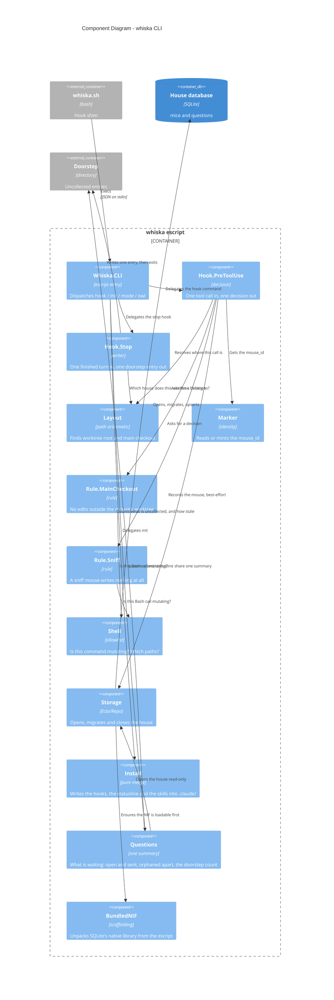

# Component Diagram — the `whiska` CLI (v0.0.1)

Level 3 for the escript — the hooks, `init`, `mode`, and the command that boots the owl.
Every module here exists in `lib/whiska/` with a test beside it in `test/whiska/`. The
owl's own internals are a separate diagram: [c4-components-owl.md](c4-components-owl.md).

## The load-bearing choices

**`Layout` is pure path arithmetic, not git.** It walks up from the working directory
until an ancestor's parent is named `worktrees`; that ancestor is the worktree root and
its grandparent is the main checkout. No `git worktree list`, no `.git` probing
(ADR-0030). It is re-derived every invocation rather than recorded, which is what lets
the marker file stay a bare opaque id with no parsing (ADR-0002).

**The decision never depends on storage.** `Hook.PreToolUse` treats identity and
bookkeeping as best-effort; the rule itself does not read the database to contain a
worktree. A malformed payload or a house that will not open **allows** the call and
writes to stderr. Failing closed would let one bad payload brick every tool call in a
session with no way out — a far larger blast radius than the hole it closes. (ADR-0011's
"deny immediately" is a narrower rule about approval flows, which this slice has none of.)

**The two rules are deliberately wrong in opposite directions.** `Rule.MainCheckout`
polices only literal `file_path` targets plus Bash calls that are *both* mutating *and*
name a main-checkout path, precisely so it can never produce a false denial on the
person. `Rule.Sniff` denies every edit tool outright and treats anything `Shell` cannot
read as mutating — a false denial there lands on the mouse, which can reach for `Read` or
`Grep`, while one missed mutation defeats the whole mode (ADR-0034).

**`Shell` is an allowlist, not a parser.** It masks quoted spans and escapes to a filler
of equal byte length before locating operators, so `grep -r "=>" lib/` is not read as a
redirect, and it judges on tokens rather than raw text so `find . -exec grep …` is not
confused with `exec rm`. Substitutions and nested shells are refused outright.

**`Questions` is read by two commands so they cannot disagree** (ADR-0027). `whiska
questions` renders the whole summary; `whiska statusline` renders one segment of it —
detail for exactly one open question, a count for more. Orphaned questions are listed
but never counted (ADR-0036). The doorstep is the one source the database cannot see:
an entry uncollected past the owl's backstop is the "owl down" signal, derived from age
until the owl answers a socket. Nothing here writes or collects.

**`Hook.Stop` never opens a socket, and never classifies.** It reads the payload, works
out the house, writes the whole final message to the doorstep and exits — unconditionally
(ADR-0036). Outside a worktree it is a no-op: there is no mouse there to speak for. It is
Elixir despite ADR-0033 saying hooks go native, and that is written down in the ADR rather
than drifted into: the measurement there is about the per-tool-call path, and `Stop` fires
once per turn.

**`BundledNIF` is scaffolding with a known end.** An escript is a zip with no `priv/`,
and native code cannot be `dlopen`ed out of a zip — so SQLite's 1.6 MB library travels as
embedded bytes and unpacks to `~/.cache/whiska/`. It is the only reason ADR-0030's single
binary and ADR-0028's real SQLite both hold. When ADR-0033's native hook client lands, the
hook stops touching storage and this module is deleted whole.
