# Component Diagram — the `whiska` CLI

Level 3 for the escript — the hooks, `init`, `mode`, `shape`, `doctor`, the delivery-side commands
(`start`, `questions`, `reply`, `close`, `mice`, `worktrees`), the machine-wide pair (`waiting`,
`jump`), the eight one-word commands (`inbox`, `show`, `reply`, `dismiss`, `focus`, `away`,
`hold`, `resume`), and the command that boots the owl.
Every module here exists in `lib/whiska/` with a test beside it in `test/whiska/`. The
owl's own internals are a separate diagram: [c4-components-owl.md](c4-components-owl.md).

```mermaid
C4Component
  title Component Diagram - whiska CLI

  Container_Ext(shim, "whiska.sh", "bash", "Hook shim")

  Container_Boundary(cli, "whiska escript") {
    Component(main, "Whiska.CLI", "escript entry", "Dispatches hook / init / mode / shape / doctor / start / questions / reply / close / mice / worktrees / waiting / jump / owl, the words inbox / show / dismiss / away / focus / hold / resume, and owl install / stop / start / uninstall")
    Component(mode, "Delivery.Mode", "the person's say", "Away: a file under the whiska home. Focus: this house's. Held: each mouse's. What may be delivered now, and why a question waits")
    Component(heldrule, "Rule.Held", "rule", "A mouse on hold is refused every call the hook sees, and told to end the turn")
    Component(personsrule, "Rule.Persons", "rule", "The person's commands - away, hold, focus, resume, reply, dismiss, close - are not a mouse's to run")
    Component(hook, "Hook.PreToolUse", "decision", "One tool call in, one decision out")
    Component(stop, "Hook.Stop", "writer", "One finished turn in, one doorstep entry out")
    Component(prompthook, "Hook.UserPromptSubmit", "the take", "One prompt in a mouse's session in; the answer saved for it out, as context, stamped taken")
    Component(flagm, "AnswerFlag", "file", "Raises and lowers the hint in the worktree's git admin directory that the shim reads")
    Component(bell, "Doorbell", "line + sweep", "The one fixed line reply types into a mouse's pane; the owl's re-ring sweep lives beside it")
    Component(sessionstart, "Hook.SessionStart", "printer", "One session start in, its role's rules out: none outside herdr")
    Component(rules, "Rules", "pure", "The named parts each role starts with: the main session's, a mouse's")
    Component(session, "Session", "identity", "Which session is this: the worktree it started in, and whether its pane is the main session")
    Component(layout, "Layout", "path arithmetic", "Finds worktree root and main checkout")
    Component(markerm, "Marker", "identity", "Reads or mints the mouse_id")
    Component(shapem, "Shape", "pure", "A spawn's mode, model and effort, and the flags to start Claude with; the catch-all from priv/models.json for what the spawn left unnamed")
    Component(specm, "Spec", "file", "Names the spec file and keeps it out of git through the main checkout's info/exclude")
    Component(tx, "Transcript", "reader", "Claude Code's JSONL: where the session started, its tail, whether a subagent is still out, and the model its latest answer came from")
    Component(mainrule, "Rule.MainCheckout", "rule", "No edits outside the mouse's worktree")
    Component(sniffrule, "Rule.Sniff", "rule", "A sniff mouse, or one nobody shaped, writes nothing at all")
    Component(shell, "Shell", "allowlist", "Is this command mutating? Which paths?")
    Component(storage, "Storage", "Ecto/Repo", "Opens, migrates and closes the house")
    Component(install, "Install", "pure merge", "Writes the four hooks, the statusline and the skills into the repo, and the machine-wide status script into ~/.whiska/")
    Component(claudemd, "ClaudeMd", "pure", "Which parts a CLAUDE.md keeps, and taking an older Whiska's block back out")
    Component(questions, "Questions", "one summary", "What is waiting: open and sent, answers not taken and orphaned apart, the doorstep count")
    Component(waiting, "Waiting", "every house", "What is waiting machine-wide: one entry per question, per answer not taken and per uncollected doorstep entry, oldest first, each with its mouse pane")
    Component(statusline, "Statusline", "one line", "herdr's tab bar: the owl always, and what is waiting machine-wide")
    Component(watch, "Watch", "the board", "A row per mouse of this repo: its branch, what its pane is doing, and the question waiting on you, its topic, or what it is stuck in")
    Component(doctor, "Doctor", "checks, never repairs", "Is Whiska working for this repo? Probes the hooks live, and reads herdr's config")
    Component(record, "OpenHouses", "text file", "The owl's record of open houses, trusted while an owl is alive")
    Component(backstop, "Backstop", "text file", "The house's mark of what only its backstop collected")
    Component(agent, "ServiceManager", "behaviour + wrapper", "The owl's job: LaunchAgent under launchd on macOS, SystemdUnit under systemd on Linux - rendered, written, and driven through launchctl or systemctl")
    Component(nif, "BundledNIF", "scaffolding", "Unpacks SQLite's native library from the escript")
  }

  ContainerDb(db, "House database", "SQLite", "mice and questions")
  Container_Ext(doorstep, "Doorstep", "directory", "Uncollected entries")
  System_Ext(herdr, "herdr", "pane list, worktree list for worktrees, main-session focus for jump, and starting Claude in a pane")
  Container_Ext(owl, "Owl", "process", "Found in the process table until the global socket exists")

  Rel(shim, main, "Execs", "JSON on stdin")
  Rel(main, stop, "Delegates the stop hook")
  Rel(stop, tx, "Is this turn over, or is a reviewer still out?")
  Rel(stop, session, "Which mouse is this, if any?")
  Rel(session, waiting, "Is this pane the house's main session?")
  Rel(stop, doorstep, "Writes one entry, then exits")
  Rel(main, hook, "Delegates the hook command")
  Rel(main, prompthook, "Delegates the user-prompt-submit hook")
  Rel(prompthook, session, "Which mouse is this, if any?")
  Rel(prompthook, storage, "Reads the chased answer, stamps it taken and the mouse working")
  Rel(prompthook, flagm, "Lowers it once nothing is chased")
  Rel(main, storage, "reply: saves the answer before anything is typed")
  Rel(main, flagm, "reply: raises it")
  Rel(main, bell, "reply: the doorbell line for this question")
  Rel(main, herdr, "reply: rings the mouse's doorbell, never the answer itself", "agent.prompt")
  Rel(main, shapem, "shape: reads the mode and model before minting anything")
  Rel(main, markerm, "shape and mode: mint the mouse_id before Claude starts")
  Rel(main, storage, "shape: records mode, model and when, before Claude starts")
  Rel(main, specm, "shape and mode: make git ignore the spec the mouse writes after grilling")
  Rel(main, install, "Delegates init; init --global writes the eight words under the whiska home, skipping one another program answers to")
  Rel(main, mode, "away, focus, hold, resume: set and clear them; inbox and show say why a question waits")
  Rel(main, claudemd, "init and uninstall: take an old block out of CLAUDE.md")
  Rel(main, sessionstart, "Delegates hook session-start")
  Rel(sessionstart, session, "Mouse or main session?")
  Rel(sessionstart, claudemd, "Which parts the person keeps")
  Rel(sessionstart, rules, "The parts that role starts with")
  Rel(main, questions, "Delegates questions")
  Rel(main, statusline, "Delegates statusline")
  Rel(main, watch, "Delegates watch and statusline --here")
  Rel(watch, herdr, "What each mouse's pane is doing", "pane.list")
  Rel(statusline, waiting, "What is waiting: every recorded house, or just this one")
  Rel(main, waiting, "Delegates waiting and jump")
  Rel(waiting, record, "Which repos to look in: read without the owl-alive guard")
  Rel(waiting, storage, "Opens each house read-only: questions, mouse panes, main session")
  Rel(waiting, doorstep, "Reads each house's uncollected entries")
  Rel(main, herdr, "jump: focuses one house's main session", "pane.focus")
  Rel(main, herdr, "start: types claude at this pane's prompt when nothing runs there", "pane.send_text")
  Rel(statusline, owl, "Is it running? Same probe as the doctor", "process table")
  Rel(doctor, owl, "Is it running, and older than the binary it runs?", "process table, ps")
  Rel(doctor, record, "Which houses are open, and is this repo one of them")
  Rel(doctor, backstop, "Has the backstop been doing the idle trigger's job")
  Rel(doctor, herdr, "Is the tab bar entry that draws the line in herdr's config?", "config.toml")
  Rel(doctor, statusline, "Is this repo's statusLine ours, and on a timer?")
  Rel(main, agent, "owl install / stop / start / uninstall")
  Rel(agent, install, "Wrapper is built from the shim's resolution fragments")
  Rel(doctor, agent, "Installed? loaded? running? two owls? survives logout?", "launchctl print, systemctl show")
  Rel(questions, storage, "Opens the house read-only")
  Rel(questions, doorstep, "Counts what is uncollected, and how stale")
  Rel(main, doctor, "Delegates doctor")
  Rel(doctor, shim, "Runs each hook with a no-op payload", "outside any worktree")
  Rel(doctor, install, "Compares the shim and hook commands with what init writes")
  Rel(doctor, herdr, "Is the main session's prompt box on its screen?", "pane.get, pane.read")
  Rel(doctor, storage, "Opens the house; reads main session, questions, mice")
  Rel(doctor, doorstep, "Counts what is waiting")
  Rel(doctor, tx, "When did the main session start, and so what wiring did it load")
  Rel(hook, session, "Whose session is this?")
  Rel(session, tx, "Where did this session start?")
  Rel(session, layout, "Resolves the start directory to a worktree")
  Rel(hook, markerm, "Gets the mouse_id")
  Rel(hook, heldrule, "Asks first: is this mouse on hold?")
  Rel(hook, personsrule, "Then: is this one of the person's commands?")
  Rel(personsrule, shell, "Splits the command line and reads each head word")
  Rel(hook, mainrule, "Asks for a decision")
  Rel(hook, sniffrule, "Asks for a decision")
  Rel(questions, mode, "Why each question waits: held, away, focus")
  Rel(waiting, mode, "The same, per house, and whether the person is away")
  Rel(doctor, mode, "What the person set aside, as one line")
  Rel(mainrule, shell, "Is this Bash call mutating?")
  Rel(sniffrule, shell, "Is this Bash call mutating?")
  Rel(hook, storage, "Records the mouse, best-effort")
  Rel(storage, nif, "Ensures the NIF is loadable first")
  Rel(storage, db, "Opens, migrates, upserts")

  UpdateLayoutConfig($c4ShapeInRow="4", $c4BoundaryInRow="1")
```

## The load-bearing choices

**`Session` decides whose session it is; `Layout` only turns a directory into a worktree.**
The working directory Claude Code hands a hook follows every `cd` the session runs, so it
is a position, not an identity. `Session` reads the two things that do not move: the pane,
from `HERDR_PANE_ID` against the main pane `whiska start` recorded, and the directory the
session started in, from the first entry of its own transcript (ADR-0053). Either can be
absent — no herdr, no transcript — and each falls back to what identity was before it.

**`Layout` is path arithmetic, with one look at git.** It walks up from the directory it
is handed until an ancestor's parent is named `worktrees`; that ancestor's grandparent is
the main checkout. A slashed branch name nests on disk, so the worktree root is the
deepest directory below `worktrees/` carrying the `.git` file git writes into a linked
worktree, and the branch label is its path relative to `worktrees/` — falling back to the
folder directly under `worktrees/` when there is no such file. No `git worktree list`
(ADR-0030 and its note). It is re-derived every invocation rather than recorded, which is what lets
the marker file stay a bare opaque id with no parsing (ADR-0002).

**A mouse is shaped before it starts** (ADR-0069). `spawn-worktree` runs `whiska shape`
in the new worktree before `herdr agent start`, so the mouse record, its mode, model and
effort are in the house before any tool call can arrive — the first one a sniff mouse
makes is already judged as sniff. The model and effort are chosen by the spawning
session from the ordered rules in `priv/models.json`, which `Shape.Rules` checks at
build time and `whiska shape --rules` prints
(ADR-0073). stdout is only the flags to
start Claude with, plain words or nothing, so the skill can split them into `claude`'s
arguments; what was recorded goes to stderr for the report. The model the mouse
actually ran on comes back later: `Hook.Stop` reads it from the transcript and carries
it on the doorstep entry, and the owl records it as `ran_on`. A mouse minted lazily by the hook instead has no `shaped_at`: `Storage.mode`
reads it as `unshaped`, `Rule.Sniff` holds it to sniff's rules with a reason that sends
it to the person, and `Mice` says `never shaped, reads only`. `whiska mode` moves the mode
alone, so `shaped_as` keeps the mode the model and effort were chosen with, and `Mice`
says when a mouse was moved off it (ADR-0074).

Shaping, and setting a mode, also makes git ignore the worktree's `.whiska-spec.md`, the
spec the mouse writes after grilling
(ADR-0076). The line goes into the
main checkout's `.git/info/exclude`, which a mouse may not edit itself (ADR-0013). A
failure there is a line on stderr, not a failed spawn. The mouse's `git check-ignore`
then says so under its spec, and until the line is there the owl only leaves the
worktree standing.

**The decision never depends on storage.** `Hook.PreToolUse` treats identity and
bookkeeping as best-effort; the rule itself does not read the database to contain a
worktree. A malformed payload or a house that will not open **allows** the call and
writes to stderr. Failing closed would let one bad payload brick every tool call in a
session with no way out — a far larger blast radius than the hole it closes. (ADR-0011's
"deny immediately" is a narrower rule about approval flows, which this slice has none of.)

**The two rules are deliberately wrong in opposite directions.** `Rule.MainCheckout`
polices only literal `file_path` targets plus Bash calls that are *both* mutating *and*
name a main-checkout path, precisely so it can never produce a false denial on the
person. `Rule.Sniff` denies every edit tool outright and treats anything `Shell` cannot
read as mutating — a false denial there lands on the mouse, which can reach for `Read` or
`Grep`, while one missed mutation defeats the whole mode (ADR-0034).

**`Shell` is an allowlist, not a parser.** It masks quoted spans and escapes to a filler
of equal byte length before locating operators, so `grep -r "=>" lib/` is not read as a
redirect, and it judges on tokens rather than raw text so `find . -exec grep …` is not
confused with `exec rm`. Substitutions and nested shells are refused outright.

**`Statusline` draws two lines, one per surface** (ADR-0048). Both follow ADR-0027's rule:
detail for one thing, a count for several.

The machine-wide line is what herdr's tab bar shows, once for the whole machine, so it
asks `Waiting` for every recorded house's questions and doorstep entries and renders the
owl's state in front of them. The owl comes first and is always shown — `🦉 watching` or
`🦉 owl down` — because a blank tab bar entry could not be told apart from a broken
Whiska (ADR-0027, second addendum). Up means found in the process table, the probe the
doctor uses (`Whiska.Owl.pids/0`), and collecting: the doorstep is the one source the
database cannot see, and an entry uncollected past the owl's backstop still means down,
until the owl answers a socket.

The repo-scoped line is no longer this component's: it is the board (ADR-0051), which
`Watch` renders and the house writes to a file.

**`Watch` is the board** — a row per mouse of this repo, ordered by how much each wants
the person: waiting, blocked, working, quiet, five rows at most, and never a cap that
drops a mouse with a question on it. The detail column is that question when there is
one, otherwise the mouse's topic from herdr's pane list, and otherwise what it is stuck
in, read from its own Claude Code transcript (ADR-0050). A dead mouse has no row; what it left waiting is counted underneath and
settled with `whiska questions`. Both `whiska watch` and
`whiska statusline --here` print it, worked out afresh; the statusline itself prints the
file the house keeps, and starts nothing.

Nothing here writes or collects.

**`Waiting` is the machine-wide reading, and `jump` is the only thing in Whiska that
moves the person** (ADR-0043). `whiska waiting` walks every repo in the open-houses
record and lists one entry per open or sent question and per uncollected doorstep entry,
oldest first, each carrying the mouse's herdr pane; `whiska jump` focuses the main
session of the house the top one belongs to, or of a named repo or branch. Three things
are worth naming. It reads the record with `read/1` rather than `open/2`, so it works
with the owl down — nothing here claims a house is *open*, the record only says which
repos to look in (ADR-0039). It lands on the house's main session rather than on a
mouse's pane: that is the pane the question was delivered into and the one the person
answers from, while a mouse's pane is the mouse's workplace (ADR-0043, note of
2026-09-28). And `Statusline` renders this same listing rather than keeping its own copy,
so the line and the listing cannot disagree about what "waiting" means. Nothing in the
owl calls `focus`, and nothing in the owl reaches into another repo at all: herdr's tab
bar runs the status script on its own timer (ADR-0048).

**`Hook.Stop` never opens a socket, and never classifies.** It reads the payload, works
out the house, writes the whole final message to the doorstep and exits — unconditionally
(ADR-0036). Nothing in it depends on the owl being up. It does read one row out of the
house first, the pane `whiska start` recorded: a stop firing there is the person’s own
session, not a mouse (ADR-0053). Outside a worktree it is a no-op: there is no mouse there
to speak for. It is
Elixir despite ADR-0033 saying hooks go native, and that is written down in the ADR rather
than drifted into: the measurement there is about the per-tool-call path, and `Stop` fires
once per turn.

**`Hook.SessionStart` prints one role's rules, and `ClaudeMd` only ever takes text out**
(ADR-0081). The hook reads the role the way `Hook.Stop` does — a
session started in a worktree and not in the recorded main pane is a mouse — and prints
`Rules` for it as the hook's additional context, leaving out any part a `CLAUDE.md` holds
as `keep` (ADR-0045). Outside herdr it prints nothing, and the global shim does not even
start the escript. `ClaudeMd` reads an older Whiska's block by ADR-0045's grammar and takes
it out on `init` and `uninstall`: Whiska's header and parts go, a `keep` part and the
person's own text inside the markers stay, and everything outside them comes back byte for
byte. The marker text in the rules is interpolated from `Question.Marker.render/1`, so what
a mouse is told to write and what the owl reads back cannot drift.

**The `finish` part is where finishing lives, and nothing in the escript runs it**
(ADR-0048). A mouse checks its own work against the brief, runs the repo's checks, sends
reviewers over its own diff and goes round once more, all inside the turn. Whiska writes
the words and never learns whether they were followed. `Install` keeps the retired
`review-loop.sh` path for two purposes only: recognising a `Stop` entry an older version
wrote, so `init` removes it, and letting the doctor name a file left on disk.

**The shim's `stop` path is one `exec`, like `pre-tool-use`.** One `Stop` entry in
`settings.json`, nothing chained in front of it, no stdin capture — which is what keeps
`Hook.Stop` literally as ADR-0036 describes it, unconditional and never classifying.

**`Doctor` checks and never repairs, and probes rather than inspects (ADR-0038).** It
runs the repo's committed shim for both hooks with a payload whose `cwd` is outside any
worktree, so the whole resolution path runs and nothing is written; it compares the
shim byte for byte with what `Install` writes, because the old no-argument shim passes
the probe silently; and it asks herdr about the recorded main session with the same call
the delivery gate uses. It reads that session's screen with the same call too, and warns
when nothing on it is a prompt box while the pane is not scrolled away from one — the one
check that would catch a Claude Code redesign, which otherwise shows up only as delivery
stopping everywhere at once (ADR-0068). It also asks how old each running thing is, because up and old
looks exactly like up: the owl's process against the installed binary, that binary
against the escript built in the checkout, the repo's statusline script against the
version this build ships (ADR-0059), and the main session — aged by the creation time of its own
transcript file, found through the session id herdr names for its pane — against the
settings files it read at startup. Every finding prints its fix. `fail` means a mouse's question
here would be lost or never written; `warn` means degraded but nothing lost.

**`ServiceManager` is one behaviour with a module per platform** (ADR-0040,
ADR-0077). `LaunchAgent` renders a plist for
launchd and `SystemdUnit` a unit for systemd; `:os.type()` picks one, and the CLI's four
`owl` verbs and the doctor's line go through whichever is in force. Both are pure values
plus writes under a given home: the job file and the wrapper are rendered from data;
install and uninstall write them where they are told; every `launchctl` or `systemctl`
call goes through a runner the tests replace, and a runner whose program is missing
answers as a failed call rather than a crash. The test config pins the manager to launchd,
points the user home away from the real machine, and installs runners that refuse. The
wrapper is assembled from
`Install`'s own `resolve_whiska` and `resolve_escript` fragments, so the shim, the tab
bar's status script and the owl's launcher cannot disagree about where the runtime is.

**`BundledNIF` is scaffolding with a known end.** An escript is a zip with no `priv/`,
and native code cannot be `dlopen`ed out of a zip — so SQLite's 1.6 MB library travels as
embedded bytes and unpacks to `~/.cache/whiska/`. It is the only reason ADR-0030's single
binary and ADR-0028's real SQLite both hold. When ADR-0033's native hook client lands, the
hook stops touching storage and this module is deleted whole.
