# Component Diagram — the owl

Level 3 for the owl, which is real code as of the owl slice. Everything here is in
`lib/whiska/owl/`, `lib/whiska/doorstep*`, `lib/whiska/herdr*`, `lib/whiska/delivery/`,
`lib/whiska/open_houses.ex`, `lib/whiska/backstop.ex`, `lib/whiska/watch*`,
`lib/whiska/cleanup.ex`, `lib/whiska/spec_archive.ex`, `lib/whiska/pickup.ex`, `lib/whiska/doorbell.ex`,
`lib/whiska/mouse_pane.ex`, `lib/whiska/git.ex` and
`lib/whiska/question/marker.ex`, each
with a test beside it. The two sockets the owl answers on — `Whiska.Owl.Listener`,
`Whiska.Owl.Answers` and `Whiska.Owl.Hooks` — are tested through their real clients:
`nc -U`, the hook shim run by `/bin/bash`, and herdr's tab bar script.

```mermaid
C4Component
  title Component Diagram - the owl

  System_Ext(herdrd, "herdr", "Panes and agent status")
  System_Ext(nc, "Desktop notifications", "terminal-notifier or osascript on macOS, notify-send on Linux")
  Container_Ext(cliboot, "whiska owl", "escript command", "Boots the owl in the foreground")
  Container_Ext(shim, "whiska.sh", "bash", "Hook shim; asks the owl first")
  Container_Ext(tabbar, "herdr-status.sh", "bash", "herdr's tab bar script; the person's own scripts ask the same way")
  Container_Ext(hookmods, "Whiska.Hook.*", "the hook modules", "The same code the escript runs for whiska hook")

  Container_Boundary(owl, "Owl") {
    Component(sup, "Whiska.Owl", "Supervisor", "One House per open project, each supervised alone")
    Component(house, "Whiska.Owl.House", "GenServer", "Pane discovery, subscription, collection, delivery")
    Component(listener, "Whiska.Owl.Listener", "one per socket", "owl.sock and hook.sock in ~/.whiska, owner-only; each connection in its own process")
    Component(answers, "Whiska.Owl.Answers", "read-only", "owl.sock: waiting, show one question, the tab bar line - JSON with a version")
    Component(hooks, "Whiska.Owl.Hooks", "hook socket", "hook.sock: runs a hook with the environment the shim sent, answers ok and its stdout")
    Component(herdrb, "Whiska.Herdr", "behaviour", "The one mocked boundary (ADR-0031)")
    Component(sock, "Whiska.Herdr.Socket", "gen_tcp on a Unix socket", "Newline-delimited JSON; list_panes, subscribe, worktree remove")
    Component(cleanup, "Whiska.Cleanup", "sweep", "One pass per backstop: note every landed branch, then take down the clean, pushed, quiet ones")
    Component(pickup, "Whiska.Pickup", "sweep", "One pass per backstop: whose turn ended without reaching the doorstep, and one line into that pane. Never a mouse with an answer not yet taken")
    Component(bell, "Whiska.Doorbell", "sweep", "One pass per backstop: every answer saved and not taken, rung again at most three times, then marked not taken")
    Component(mousepane, "Whiska.MousePane", "bounds", "Which pane is a mouse's, whether herdr calls its folder a worktree of this checkout, and what its prompt box holds")
    Component(gitq, "Whiska.Git", "git", "Merged, reached by a merge, clean, unpushed - and the removals, never forced")
    Component(doorstep, "Whiska.Doorstep", "file store", "Reads entries, marks them collected by rename")
    Component(entry, "Whiska.Doorstep.Entry", "struct", "mouse_id, branch, worktree_root, stamped_at, text, ran_on: the model the turn ran on, and spec: the worktree's spec when the turn ended")
    Component(archive, "Whiska.SpecArchive", "file store", "A copy of each spec sent, in .whiska/specs/ in the main checkout: written at collection, marked landed or dropped by the sweep")
    Component(markerq, "Whiska.Question.Marker", "classifier", "done / needs-decision / unmarked, by marker alone")
    Component(draft, "Whiska.Delivery.Draft", "classifier", "Where would the line land? empty / typing / no box / unknown")
    Component(mode, "Whiska.Delivery.Mode", "judge", "What the person set aside: away (a file), this house's focus, its held mice. What goes next, oldest first, and why a question waits")
    Component(storage, "Whiska.Storage", "Ecto", "Questions, mode, dead and removed mice")
    Component(hoot, "Whiska.Delivery.Hoot", "composer", "The desktop notification for a delivered question, in the delivered line's own words; sends it through herdr, and on the desktop when herdr will not show it")
    Component(desktop, "Whiska.Desktop", "behaviour", "The desktop's notifier, reached without herdr; one argument per piece of text, never a shell")
    Component(storage, "Whiska.Storage", "Ecto", "Questions, mode, dead mice")
    Component(record, "Whiska.OpenHouses", "text file", "Which houses are open; trusted only while an owl is alive")
    Component(backstop, "Whiska.Backstop", "text file", "How much this house's backstop collected that the idle trigger missed")
    Component(watch, "Whiska.Watch", "the board", "The facts about each mouse: its question, how its pane stands with herdr, its topic and last action")
    Component(sidebar, "Whiska.Sidebar", "pure", "Each mouse's sidebar line, ranked and led by its colour-key symbol; the main checkout's line; which workspace each goes under")
    Component(transcript, "Whiska.Watch.Transcript", "reader", "The last tool call or sentence and how long the mouse has been silent, from its own Claude Code transcript, over Whiska.Transcript, which pickup reads too")
  }

  ContainerDb(db, "House database", "SQLite", "mice and questions")

  Rel(cliboot, record, "Reads what was open last time")
  Rel(cliboot, sup, "Starts with the repos to open")
  Rel(sup, house, "Opens and shuts")
  Rel(sup, listener, "Starts both, apart from the houses")
  Rel(tabbar, listener, "line, with the jump key", "nc -U, owl.sock")
  Rel(shim, listener, "hook name, environment, payload", "nc -U, hook.sock")
  Rel(listener, answers, "Hands each owl.sock connection to")
  Rel(listener, hooks, "Hands each hook.sock connection to")
  Rel(answers, record, "Which houses to read; show answers only for one in it")
  Rel(answers, storage, "Each house on a connection of its own, never creating one")
  Rel(hooks, hookmods, "Runs the hook, with the hook's environment")
  Rel(hooks, house, "After a Stop is written: collect now")
  Rel(sup, record, "Adds on open, removes on shut")
  Rel(house, herdrb, "Lists panes, subscribes, raises the hoot")
  Rel(herdrb, sock, "Dispatched to the configured implementation")
  Rel(sock, herdrd, "One request per connection; events stream")
  Rel(house, mode, "Judges the queue against it before the gate; notices a change on the board tick")
  Rel(house, draft, "Judges the main pane's screen before typing into it")
  Rel(house, hoot, "Composes and sends the hoot for the question it has just typed")
  Rel(hoot, herdrb, "Asks herdr to show it")
  Rel(hoot, desktop, "Raises it there when herdr's popups are off or nobody is attached")
  Rel(desktop, nc, "Runs the notifier with an argument list")
  Rel(house, doorstep, "Collects")
  Rel(house, backstop, "Marks what only the backstop found; clears it at open")
  Rel(doorstep, entry, "Decodes each JSON file")
  Rel(house, markerq, "Classifies each entry's text")
  Rel(house, storage, "Writes questions, marks mice dead")
  Rel(house, cleanup, "Sweeps on the backstop")
  Rel(cleanup, gitq, "Asks the four preconditions, removes the worktree and the branch")
  Rel(cleanup, herdrb, "Removes a landed worktree and closes its pane, never forced")
  Rel(cleanup, storage, "Stamps the mouse removed")
  Rel(house, archive, "Keeps the spec an entry carried, naming the question just recorded")
  Rel(cleanup, archive, "Marks each kept spec landed or dropped, after noting landings")
  Rel(house, pickup, "Sweeps on the backstop, handing it the pane list it already has")
  Rel(pickup, mousepane, "Finds the pane, asks whose worktree it is, reads its box")
  Rel(pickup, herdrb, "One line into the mouse's own pane")
  Rel(house, bell, "Sweeps on the backstop before pickup, with the same pane list")
  Rel(bell, mousepane, "The same bounds pickup types within")
  Rel(bell, herdrb, "The doorbell again, into the mouse's own pane")
  Rel(bell, storage, "Reads the chased answers; counts each ring, marks one not taken")
  Rel(house, hoot, "One hoot for an answer the owl gave up on")
  Rel(mousepane, draft, "Judges the mouse's own screen")
  Rel(mousepane, herdrb, "Which worktrees are this checkout's", "worktree.list")
  Rel(pickup, doorstep, "Is anything of this mouse's still uncollected")
  Rel(pickup, storage, "Reads worked_at, stamps picked_up_at")
  Rel(house, watch, "Builds the board every 2 s")
  Rel(watch, transcript, "What a working mouse is doing, or a stalled one is stuck in")
  Rel(pickup, transcript, "Does the mouse's transcript end on an API error")
  Rel(house, sidebar, "Turns the board into lines every second")
  Rel(house, herdrb, "Reports each line on its workspace; reads them back; re-sorts the mice", "workspace.report_metadata, workspace.list, workspace.move_block")
  Rel(storage, db, "Ecto/exqlite")

  UpdateLayoutConfig($c4ShapeInRow="4", $c4BoundaryInRow="1")
```

## The load-bearing choices

**Pane discovery exists because the subscription is per pane.** Checked against herdr
0.8.2: `pane.agent_status_changed` needs a named `pane_id` and rejects a wildcard, while
`pane.closed`, `pane.exited`, `pane.agent_detected` and `workspace.closed` are global. So a house matches each
pane's `cwd` up to a mouse record's worktree path, records the pane id on the mouse — the
first and only thing that ever fills ADR-0006's `pane` column — and reopens the
subscription whenever that set changes. A dropped connection is retried with a wait, and
kept being retried while herdr is down.

**The owl answers on two sockets, and neither is a house's** (ADR-0025, ADR-0033).
`Whiska.Owl` starts one `Whiska.Owl.Listener` per socket beside its houses, so a house
crashing never takes them down and a busy house never holds up a caller: each connection
is handed to a process of its own. `owl.sock` is read-only and documented —
`Whiska.Owl.Answers` reads `Whiska.Waiting` and `Whiska.Statusline`, the same code
`whiska waiting` and `whiska statusline` run, so the socket and the commands cannot
disagree. `hook.sock` is private: `Whiska.Owl.Hooks` runs the very `Whiska.Hook.*` module
the escript would, with the environment the shim forwarded rather than the owl's own, and
answers `ok` with what the escript would have printed. Every house read on either socket
opens a connection of its own, so two callers at once never meet on one name. A socket
file left by a crashed owl is removed at start; one that still answers is another owl's,
and is left alone (ADR-0001). A clean stop removes both.

**Four collection triggers, only one a timer.** The owl writing a `Stop` entry itself,
over the hook socket, then asking that house to collect at once (ADR-0036, amended); a
mouse pane going idle; the house opening; and a slow backstop. An idle collection that finds nothing retries after 2 s and
5 s, since the idle event can beat the mouse's `Stop` hook to the doorstep. Collection
reads and marks; it never deletes and never touches the worktree (ADR-0007). Cleanup, on
the same backstop, is the one thing in the owl that does (ADR-0061).

**The backstop is loud about what it finds.** Anything it collects is something the idle
trigger should have brought a minute earlier, so the house warns on stderr and marks it
in `Whiska.Backstop` for `whiska doctor` to read later. Collecting at open does not count
— that is the designed "what landed while the owl was down" path — and neither do the
idle trigger's own retries. Without this, a trigger that never fires looks exactly like a
healthy owl, which is what happened (ADR-0036, note of 2026-09-28).

**Each mouse's line is reported, never asked for**
(ADR-0082). Every other second the house lists
herdr's panes and workspaces and builds the board; every second it turns the board into
lines and reports each one that differs from what herdr holds onto that mouse's workspace,
with a thirty-second TTL, sent again before it lapses. Reading the workspaces back is how a
herdr restart, which drops every line, is noticed: the lines are gone, so they are sent
again. Nothing is typed into a session to produce them: a mouse's topic rides in on the
pane list herdr answers with anyway, and what it is doing comes from the transcript Claude
Code is already writing (ADR-0050). The mice are re-sorted with `workspace.move_block` only
when the set of them needing the person changes. A house touches only its own mice's
workspaces and its main checkout's, whose line says what is true of the whole repo.

**The screen is read in one place** (ADR-0047). herdr has no input signal, so the
delivery gate asks `Whiska.Herdr.read_screen/2` for the main pane's visible screen,
styling included, and `Whiska.Delivery.Draft` finds the box by its frame and decides
whether there is anywhere safe for the line to land, counting Claude Code's faint
suggestion as nothing (ADR-0068). Pickup asks the same question of a mouse's pane and
takes the same answer. The boundary returns
text and judges nothing; the classifier judges text and talks to nothing — the same split
as `Whiska.Question.Marker`, for the same reason (ADR-0031).

**The hoot is composed where the line is** (ADR-0062). A delivered question raises one
desktop notification, and `Whiska.Delivery.Hoot` builds it out of the same
`Whiska.Delivery.Text` functions that build the line, so there is one phrasing of one
event rather than two. The house sends it with `Whiska.Delivery.Hoot.send_out/4` in the
same branch that typed the line. That asks herdr first and, when herdr says its popups are
off or nobody is attached, raises the same hoot through `Whiska.Desktop`
(ADR-0071). Whatever comes back is swallowed: the question is
already recorded sent, and an owl that crashed on a failed notification would lose the
thing the notification was about. `whiska doctor` is where the outcome is read, from a hoot
it sends itself down the same path.

**Classification is the marker and nothing else** (ADR-0009). `Whiska.Question.Marker`
reads the last marker line — a line of invisible separators, three for `done` and two for
`needs-decision`, or the older `[worktree-status: …]` spelling — and maps it to `done`,
`needs-decision` or `unmarked`; anything unrecognised is `unmarked`, which is delivered.
Only that one line is read, and only that one line is stripped before the person sees the
message, so a marker quoted mid-prose survives intact.

**The hook does not classify.** `Whiska.Hook.Stop` writes the raw final message — run by
the owl over the hook socket, or by the escript when the owl does not answer — and the
house reads the marker on collection. That keeps the writer dumb and puts the one piece
of judgment on the side that can be changed without touching every mouse's `settings.json`.

**A `done` report waits for the slot, then holds it** — typed as "finished" with no
reply command once nothing is sent, ahead of whatever is queued, and left sent with the
main checkout's finish flag raised until the person's next prompt there settles it
(ADR-0009 revised 2026-09-27, ADR-0008's notes of 2026-10-06 and 2026-10-08). An entry whose worktree is gone is settled or orphaned by its branch
(ADR-0064):
recorded, surfaced, never interrupting, because there is nowhere to reply and nothing
left to change.

**Nothing here crosses houses.** A house types into its own main session and nowhere
else. Until 2026-09-29 one process did reach across — `Whiska.Owl.Nudge`, which typed
`⚡ <folders> waiting` into every other open house's main session so its statusline would
redraw — and ADR-0044 deleted it: that line arrived as a user turn the other session's
Claude could not tell from a prompt. What is waiting in another repo now reaches the
person through the machine-wide line herdr's tab bar draws, which asks the owl for it over
`owl.sock` on its own timer; the owl reads every recorded house to answer (ADR-0048). The
open-houses record is still written by the owl and still read, but only by the statusline,
the read-only socket and the doctor asking questions, never by anything acting.

**Cleanup asks this machine first and herdr last** (ADR-0061). Each mouse is judged by what
git and the house's own database can answer alone — the branch merged into the base, the
worktree clean, nothing unpushed, and the mouse quiet: its last word a `done` report,
nothing of its open or sent, nothing of its left uncollected on the doorstep. Only once
something has passed all of that is herdr asked anything, so a house with nothing landed
opens no socket. herdr then supplies the last two facts — what is sitting in the worktree, by
each pane's own working directory rather than by the record's remembered pane id, and
which workspace the worktree is open in, which have to agree with each other — and
performs the removal: one `worktree.remove`
with `force: false`, which takes the worktree and the pane together the way `drop-worktree`
always has. Anything unknown — a detached head, an unnameable base, a silent herdr, a live
pane whose workspace herdr does not name — leaves the worktree standing. It is the first
thing in Whiska that deletes anything, and the first that can close a session.

**Every landed branch is noted, torn down or not.** The same sweep stamps `landed_at` on
a mouse the first time it sees the base reach that branch's work through a merge — from
the worktree's own head while it stands, from the branch ref in the main checkout once it
has gone (V005, ADR-0064). An ancestor of the base is not enough on its own: a branch cut
an hour ago is one too. Nothing is removed on the strength of the stamp; it is what later
decides whether a question that mouse left waiting is `settled` or `orphaned`, and
collection reads it too, for an entry arriving after its worktree has gone.

**Dead mice are marked, not deleted.** `pane.closed` or `pane.exited` on a known mouse
pane stamps `died_at` (the V002 migration's one column) and cascades that mouse's open
*and sent* questions out of the queue (ADR-0026, ADR-0007) — the sent one because it holds
delivery's one slot and nothing can answer it any more. They go to `settled` when the
branch landed and `orphaned` when it did not (ADR-0064). A mouse with no pane anywhere at
house open is dead too, found by reconciling against `pane.list`; delivery is attempted
straight after, so a slot freed that way does not wait for the backstop. The same
reconciling runs when `workspace.closed` arrives, since herdr closes a dropped worktree's
workspace without a `pane.closed` for its panes, and the lines are rebuilt on the spot.

**Pickup is cleanup's mirror image, and runs on the same tick** (ADR-0067). Cleanup asks
whether a branch is finished with; pickup asks whether a turn ended without finishing.
Both are judged from what this machine already knows — the doorstep, the mouse record,
the pane list the house re-listed a moment earlier — and both treat unknown as a refusal.
The difference is what they do with the answer: cleanup takes a session away, pickup
makes one work. A transcript that ends on Claude Code's own API error is the one thing
that lets pickup skip its two-minute settling window: a wake cannot write that entry.
Pickup is one of two things in Whiska that type into a pane that is not its
house's main session, and it does so once per dead turn.

**The doorbell is the other, and it rings for the person's own answer**
(ADR-0080). `whiska reply` saves the answer and rings once;
the mouse's own `UserPromptSubmit` hook hands the answer over and stamps it taken. A
doorbell herdr accepted can still be swallowed, and only the missing stamp says so, so on
the same tick `Whiska.Doorbell` rings again for every answer saved and not taken — at
least 90 s apart, at most three times, within exactly the bounds pickup types within
(`Whiska.MousePane`), never into a held mouse or a landed branch. Each ring is counted
before it is typed and put back if herdr refuses — or its client crashes — the order
pickup's cap uses. After the third, the answer is marked not taken once and the house
raises one hoot, waiting first for the person to be back if they are away or focused
elsewhere (`Whiska.Delivery.Mode`); the sidebar line, `inbox` and `whiska questions` say so
until the mouse takes it. Pickup leaves such a mouse alone: its next turn never began.
