# Component Diagram — the owl

Level 3 for the owl, which is real code as of the owl slice. Everything here is in
`lib/whiska/owl/`, `lib/whiska/doorstep*`, `lib/whiska/herdr*`, `lib/whiska/delivery/`,
`lib/whiska/open_houses.ex`, `lib/whiska/backstop.ex`, `lib/whiska/watch*` and
`lib/whiska/question/marker.ex`, each with a test beside it.

```mermaid
C4Component
  title Component Diagram - the owl

  System_Ext(herdrd, "herdr", "Panes and agent status")
  Container_Ext(cliboot, "whiska owl", "escript command", "Boots the owl in the foreground")

  Container_Boundary(owl, "Owl") {
    Component(sup, "Whiska.Owl", "Supervisor", "One House per open project, each supervised alone")
    Component(house, "Whiska.Owl.House", "GenServer", "Pane discovery, subscription, collection, delivery")
    Component(herdrb, "Whiska.Herdr", "behaviour", "The one mocked boundary (ADR-0031)")
    Component(sock, "Whiska.Herdr.Socket", "gen_tcp on a Unix socket", "Newline-delimited JSON; list_panes and subscribe")
    Component(doorstep, "Whiska.Doorstep", "file store", "Reads entries, marks them collected by rename")
    Component(entry, "Whiska.Doorstep.Entry", "struct", "mouse_id, branch, worktree_root, stamped_at, text")
    Component(markerq, "Whiska.Question.Marker", "classifier", "done / needs-decision / unmarked, by marker alone")
    Component(draft, "Whiska.Delivery.Draft", "classifier", "Is the main session's prompt box empty? empty / typing / unknown")
    Component(storage, "Whiska.Storage", "Ecto", "Questions, mode, dead mice")
    Component(record, "Whiska.OpenHouses", "text file", "Which houses are open; trusted only while an owl is alive")
    Component(backstop, "Whiska.Backstop", "text file", "How much this house's backstop collected that the idle trigger missed")
    Component(watch, "Whiska.Watch", "renderer", "A row per mouse: branch, pane status, and the question waiting or the last action")
    Component(snapshot, "Whiska.Watch.Snapshot", "text file", "The board for one house, in ~/.whiska/board/")
    Component(transcript, "Whiska.Watch.Transcript", "reader", "The last tool call or sentence, from the mouse's own Claude Code transcript, over Whiska.Transcript")
  }

  ContainerDb(db, "House database", "SQLite", "mice and questions")

  Rel(cliboot, record, "Reads what was open last time")
  Rel(cliboot, sup, "Starts with the repos to open")
  Rel(sup, house, "Opens and shuts")
  Rel(sup, record, "Adds on open, removes on shut")
  Rel(house, herdrb, "Lists panes, subscribes")
  Rel(herdrb, sock, "Dispatched to the configured implementation")
  Rel(sock, herdrd, "One request per connection; events stream")
  Rel(house, draft, "Judges the main pane's screen before typing into it")
  Rel(house, doorstep, "Collects")
  Rel(house, backstop, "Marks what only the backstop found; clears it at open")
  Rel(doorstep, entry, "Decodes each JSON file")
  Rel(house, markerq, "Classifies each entry's text")
  Rel(house, storage, "Writes questions, marks mice dead")
  Rel(house, watch, "Renders the board every 2 seconds")
  Rel(watch, transcript, "What each mouse is doing")
  Rel(house, snapshot, "Writes the board where the statusline will find it")
  Rel(storage, db, "Ecto/exqlite")

  UpdateLayoutConfig($c4ShapeInRow="4", $c4BoundaryInRow="1")
```

## The load-bearing choices

**Pane discovery exists because the subscription is per pane.** Checked against herdr
0.8.2: `pane.agent_status_changed` needs a named `pane_id` and rejects a wildcard, while
`pane.closed`, `pane.exited` and `pane.agent_detected` are global. So a house matches each
pane's `cwd` up to a mouse record's worktree path, records the pane id on the mouse — the
first and only thing that ever fills ADR-0006's `pane` column — and reopens the
subscription whenever that set changes. A dropped connection is retried with a wait, and
kept being retried while herdr is down.

**Three collection triggers, only one a timer.** A mouse pane going idle, the house
opening, and a slow backstop. An idle collection that finds nothing retries after 2 s and
5 s, since the idle event can beat the mouse's `Stop` hook to the doorstep. Collection
reads and marks; it never deletes and never touches the worktree (ADR-0007).

**The backstop is loud about what it finds.** Anything it collects is something the idle
trigger should have brought a minute earlier, so the house warns on stderr and marks it
in `Whiska.Backstop` for `whiska doctor` to read later. Collecting at open does not count
— that is the designed "what landed while the owl was down" path — and neither do the
idle trigger's own retries. Without this, a trigger that never fires looks exactly like a
healthy owl, which is what happened (ADR-0036, note of 2026-09-28).

**The board is written, never asked for** (ADR-0051). Every couple of seconds the house
lists herdr's panes, renders a row per mouse and replaces one file. Nothing is typed into
a session to produce it: what a mouse is doing comes from the transcript Claude Code is
already writing (ADR-0050), and a mouse that will not parse simply has an empty column.
The statusline script then prints that file and starts nothing, which is what makes a
two-second refresh affordable in every open session at once.

**The screen is read in one place** (ADR-0047). herdr has no input signal, so the
delivery gate asks `Whiska.Herdr.read_screen/2` for the main pane's visible text and
`Whiska.Delivery.Draft` decides whether the person is mid-sentence. The boundary returns
text and judges nothing; the classifier judges text and talks to nothing — the same split
as `Whiska.Question.Marker`, for the same reason (ADR-0031).

**Classification is the marker and nothing else** (ADR-0009). `Whiska.Question.Marker`
reads the last marker line — a line of invisible separators, three for `done` and two for
`needs-decision`, or the older `[worktree-status: …]` spelling — and maps it to `done`,
`needs-decision` or `unmarked`; anything unrecognised is `unmarked`, which is delivered.
Only that one line is read, and only that one line is stripped before the person sees the
message, so a marker quoted mid-prose survives intact.

**The hook does not classify.** `Whiska.Hook.Stop` writes the raw final message and exits;
the owl reads the marker on collection. That keeps the writer dumb and puts the one piece
of judgment on the side that can be changed without touching every mouse's `settings.json`.

**A `done` report skips the queue and closes at once** — typed as "finished" with no
reply command, ahead of whatever is waiting and with no regard for the delivery slot,
and closed as soon as the prompt lands (ADR-0009 revised 2026-09-27, ADR-0008's note of
2026-10-01). An entry whose worktree is gone is `orphaned`:
recorded, surfaced, never interrupting, because there is nowhere to reply and nothing
left to change.

**Nothing here crosses houses.** A house types into its own main session and nowhere
else. Until 2026-09-29 one process did reach across — `Whiska.Owl.Nudge`, which typed
`⚡ <folders> waiting` into every other open house's main session so its statusline would
redraw — and ADR-0044 deleted it: that line arrived as a user turn the other session's
Claude could not tell from a prompt. What is waiting in another repo now reaches the
person through the machine-wide line herdr's tab bar draws, which reads every recorded
house off disk on its own timer (ADR-0048). The open-houses record is still written by the owl and
still read, but only by the statusline and the doctor asking questions, never by anything
acting.

**Dead mice are marked, not deleted.** `pane.closed` or `pane.exited` on a known mouse
pane stamps `died_at` (the V002 migration's one column) and cascades that mouse's open
*and sent* questions to `orphaned` (ADR-0026, ADR-0007) — the sent one because it holds
delivery's one slot and nothing can answer it any more. A mouse with no pane anywhere at
house open is dead too, found by reconciling against `pane.list`; delivery is attempted
straight after, so a slot freed that way does not wait for the backstop.
