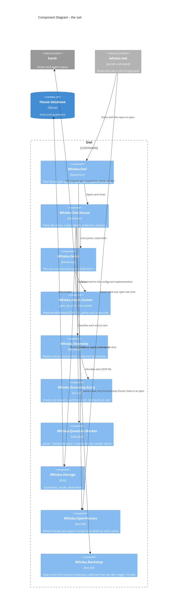

# Component Diagram — the owl

Level 3 for the owl, which is real code as of the owl slice. Everything here is in
`lib/whiska/owl/`, `lib/whiska/doorstep*`, `lib/whiska/herdr*`, `lib/whiska/delivery/`,
`lib/whiska/open_houses.ex`, `lib/whiska/backstop.ex` and `lib/whiska/question/marker.ex`, each with a test beside
it.

## The load-bearing choices

**Pane discovery exists because the subscription is per pane.** Checked against herdr
0.8.2: `pane.agent_status_changed` needs a named `pane_id` and rejects a wildcard, while
`pane.closed`, `pane.exited` and `pane.agent_detected` are global. So a house matches each
pane's `cwd` up to a mouse record's worktree path, records the pane id on the mouse — the
first and only thing that ever fills ADR-0006's `pane` column — and reopens the
subscription whenever that set changes. A dropped connection is retried with a wait, and
kept being retried while herdr is down.

**Three collection triggers, only one a timer.** A mouse pane going idle, the house
opening, and a slow backstop. An idle collection that finds nothing retries after 2 s and
5 s, since the idle event can beat the mouse's `Stop` hook to the doorstep. Collection
reads and marks; it never deletes and never touches the worktree (ADR-0007).

**The backstop is loud about what it finds.** Anything it collects is something the idle
trigger should have brought a minute earlier, so the house warns on stderr and marks it
in `Whiska.Backstop` for `whiska doctor` to read later. Collecting at open does not count
— that is the designed "what landed while the owl was down" path — and neither do the
idle trigger's own retries. Without this, a trigger that never fires looks exactly like a
healthy owl, which is what happened (ADR-0036, note of 2026-09-28).

**Classification is the marker and nothing else** (ADR-0009). `Whiska.Question.Marker`
scans for `[worktree-status: …]` and maps it to `done`, `needs-decision` or `unmarked`;
anything unrecognised is `unmarked`, which is delivered. The invisible-character prefix is
treated as optional — it is a courtesy to whoever reads the transcript, not part of the
marker's meaning, so a mouse that drops it is not misread as having said nothing.

**The hook does not classify.** `Whiska.Hook.Stop` writes the raw final message and exits;
the owl reads the marker on collection. That keeps the writer dumb and puts the one piece
of judgment on the side that can be changed without touching every mouse's `settings.json`.

**A `done` report is delivered and then closed at once** — typed as "finished" with no
reply command, and closed as soon as the prompt lands so it never holds the delivery
slot (ADR-0009, revised 2026-09-27). An entry whose worktree is gone is `orphaned`:
recorded, surfaced, never interrupting, because there is nowhere to reply and nothing
left to change.

**Nothing here crosses houses.** A house types into its own main session and nowhere
else. Until 2026-09-29 one process did reach across — `Whiska.Owl.Nudge`, which typed
`⚡ <folders> waiting` into every other open house's main session so its statusline would
redraw — and ADR-0044 deleted it: that line arrived as a user turn the other session's
Claude could not tell from a prompt. The other repo's statusline now refreshes itself on
a `refreshInterval` timer and reads what is waiting here off disk. The open-houses
record is still written by the owl and still read, but only by the statusline and the
doctor asking questions, never by anything acting.

**Dead mice are marked, not deleted.** `pane.closed` or `pane.exited` on a known mouse
pane stamps `died_at` (the V002 migration's one column) and cascades that mouse's open
questions to `orphaned` (ADR-0026, ADR-0007). A mouse with no pane anywhere at house open
is dead too, found by reconciling against `pane.list`.
