# Container Diagram — Whiska

Level 2. The deployable and storable pieces. Read the two boundaries as a timeline:
everything in *built* exists and is tested; everything in *designed, not built* is decided
in the ADRs and has no code yet.

```mermaid
C4Container
  title Container Diagram - Whiska

  Person(person, "The person", "Answers one question at a time")
  System_Ext(herdr, "herdr", "Panes, sessions, agent status")
  System_Ext(nc, "Desktop notifications", "terminal-notifier or osascript on macOS, notify-send on Linux")

  Container_Boundary(built, "Built") {
    Container(shim, "whiska.sh", "bash", "Hook shim in the repo or in ~/.claude; asks the owl first, else resolves the runtime at fire time; fails open, with a visible hook error in a worktree. The global copy stands down where the repo has its own")
    Container(statusline, "herdr-status.sh", "bash", "Machine-level status script in ~/.whiska; herdr's tab bar runs it on a timer")
    Container(cli, "whiska", "Elixir escript", "Hooks, init, mode, shape - and boots the owl")
    Container(owl, "Owl", "Elixir/OTP supervisor", "One per machine; one supervised house per open project")
    Container(house, "House", "GenServer per project", "Herdr subscription, pane discovery, collection, delivery to the main session")
    Container(doorstep, "Doorstep", "directory, .git/whiska/doorstep/", "JSON entries a Stop hook left, renamed .collected once read")
    ContainerDb(db, "House database", "SQLite, .git/whiska/whiska.db", "Mouse records and questions, one per repo")
    Container(marker, "Mouse marker", ".whiska-mouse file", "The opaque mouse_id at the worktree root")
    Container(flag, "Answer flag", "empty file, whiska-answer in the worktree's git admin directory", "This worktree's mouse has an answer not yet taken; the shim reads it so a prompt with nothing waiting starts nothing")
    Container(spec, "Spec", ".whiska-spec.md file", "What a grilled brief will build, at the worktree root; the mouse writes it, git ignores it")
    Container(kept, "Kept specs", "directory, .whiska/specs/ in the main checkout", "A copy of every spec sent, one file per spec under a header: its question, the ones it replaced, landed or dropped; git ignores it")
    Container(backstop, "Backstop mark", "text file, .git/whiska/backstop", "How much the backstop collected that the idle trigger missed, and when")
    Container(record, "Open-houses record", "text file, ~/.whiska/houses", "One main checkout per line; which houses the owl has open")
    Container(owlsock, "owl.sock", "Unix socket, ~/.whiska/", "Read-only and documented: waiting, show one question, the jump list, a house's questions, the tab bar line")
    Container(hooksock, "hook.sock", "Unix socket, ~/.whiska/", "Private: the shim asks it first, and the owl runs the hook's own code")
    Container(svc, "Owl's job", "launchd com.whiska.owl, or systemd whiska-owl.service", "Starts the owl at login, restarts a crash; runs the owl.sh wrapper")
  }

  Container_Boundary(todo, "Designed, not built") {
    Container(sockets, "Repo sockets", "Unix, per-repo", "Push approval, mouse identity")
  }

  Rel(person, cli, "Runs whiska init / init --global / uninstall / mode / owl / questions")
  Rel(herdr, statusline, "Tab bar runs it every 5 seconds and shows its last line")
  Rel(statusline, owlsock, "Asks for the line with nc; owl down when nothing answers")
  Rel(owl, owlsock, "Answers waiting, show and line from every recorded house")
  Rel(cli, herdr, "watch works out the sidebar's lines now, reading herdr's panes and workspaces")
  Rel(cli, db, "questions, statusline and waiting read every recorded house")
  Rel(cli, doorstep, "questions, statusline and waiting count what is uncollected")
  Rel(cli, herdr, "mice list panes; doctor reads herdr's config for the tab bar and sidebar rows, and its version")
  Rel(house, nc, "Raises a hoot herdr will not show; doctor probes the same path")
  Rel(cli, herdr, "start types claude at this pane's shell prompt when nothing runs there")
  Rel(cli, record, "owl reopens from it; statusline, waiting and doctor read it")
  Rel(herdr, shim, "PreToolUse, Stop and UserPromptSubmit fire in a mouse's session, UserPromptSubmit in the main session too; SessionStart in every herdr session")
  Rel(shim, flag, "user-prompt-submit exits at once unless it is there")
  Rel(shim, hooksock, "Asks first, with nc", "hook name, environment, payload")
  Rel(owl, hooksock, "Runs the same hook modules, with the hook's environment")
  Rel(shim, cli, "Execs with the payload on stdin when the owl does not answer", "JSON")
  Rel(cli, db, "reply saves the answer first; UserPromptSubmit hands it over and stamps it taken")
  Rel(cli, flag, "reply raises it; the take lowers it")
  Rel(cli, herdr, "reply rings the mouse's doorbell - one fixed line, never the answer")
  Rel(cli, marker, "Reads, minting one on first use")
  Rel(cli, db, "shape records a new mouse's mode and model before Claude starts")
  Rel(cli, spec, "shape and mode make git ignore it, through the main checkout's info/exclude")
  Rel(cli, doorstep, "Stop hook writes one entry when the owl does not answer")
  Rel(owl, doorstep, "Stop over the hook socket writes the entry; the open house collects it at once")
  Rel(cli, owl, "whiska owl boots it in the foreground")
  Rel(cli, svc, "whiska owl install / stop / start / uninstall", "launchctl or systemctl --user")
  Rel(svc, owl, "Runs whiska owl with no arguments; restarts on a crash only")
  Rel(owl, house, "Opens one per project, supervised independently")
  Rel(owl, record, "Adds a house when opened, removes it when shut")
  Rel(house, herdr, "Subscribes per mouse pane; lists panes to find them")
  Rel(house, doorstep, "Collects on idle, at open, and on a backstop")
  Rel(house, kept, "Keeps the spec a collected entry carried; the sweep marks it landed or dropped")
  Rel(house, backstop, "Marks what the backstop collected; clears it at open")
  Rel(cli, backstop, "doctor reads it: has the last resort been doing the trigger's job")
  Rel(house, db, "Records questions, marks mice dead and removed; reads the next open one")
  Rel(house, herdr, "Removes a landed worktree and closes its pane together")
  Rel(house, herdr, "Types one question at a time into the main session when idle")
  Rel(house, herdr, "Rings a mouse's doorbell again, at most three times, while its answer is not taken")
  Rel(house, herdr, "Reports each mouse's sidebar line on its workspace; reads them back every 2 s and re-sorts the mice when one starts or stops needing the person")

  UpdateLayoutConfig($c4ShapeInRow="4", $c4BoundaryInRow="1")
```

## Why each piece is its own container

The reasoning is in the ADR each line names; this is the map.

- **`whiska.sh`**: the committed hook command names only a shim, so nothing machine-specific
  reaches a shared repo; it asks `hook.sock` first and resolves the runtime itself only
  when the owl does not answer (ADR-0035, ADR-0033). The same shim hangs off the repo or
  the home; where both exist, the repo's is in force and the global one stands down
  (ADR-0056).
- **`herdr-status.sh`**: the one script not committed to a repo, because its line is
  machine-wide; it asks `owl.sock` and starts nothing (ADR-0048). No script runs per repo:
  each mouse's state is a sidebar line the house reports to herdr directly (ADR-0082).
- **`owl.sock` and `hook.sock`**: one read-only and documented, for scripts and the tab
  bar; one private, for the hooks. Neither is the per-repo socket still designed only
  (ADR-0033, ADR-0024).
- **Open-houses record**: the one machine-level file; which houses the owl has open, not
  which exist (ADR-0039, ADR-0003).
- **House database under the main checkout's `.git/`**: every worktree shares it, so a
  repo's mice are one house; SQLite, not flat files (ADR-0028).
- **Doorstep, a directory in the house**: every question enters through it, whoever writes
  the entry; a dead owl loses nothing; collected entries are renamed, never deleted, and an
  ordinary `drop-worktree` cannot erase a pending question (ADR-0036, ADR-0007).
- **Backstop mark**: per house, so the doctor's one line is about this run of this house
  (ADR-0036).
- **Mouse marker**: the opaque `mouse_id`, never the branch or path (ADR-0002).
- **Answer flag**: a hint for the shim in the worktree's git admin directory, never the
  answer, which is in the house database (ADR-0080).
- **Spec in the worktree, kept specs in the main checkout**: the spec lives and dies with
  its mouse; the copy is the archive (ADR-0063).
- **The owl's job**: the platform's service manager runs the wrapper, restarts a crash only
  (ADR-0040).
- **One owl, many houses**, each supervised independently (ADR-0001). Delivery lives in the
  house, and nothing types across houses (ADR-0008, ADR-0044).
- **herdr is the one boundary with a fake behind it** (ADR-0031).

## Designed only

The per-repo sockets with the peer-process check (ADR-0024); `whiska stop` for one house
(ADR-0003); push approval (ADR-0011).
