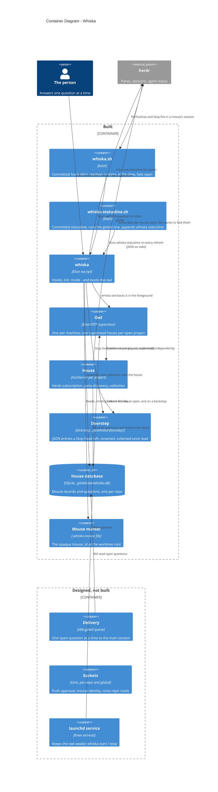

# Container Diagram — Whiska

Level 2. The deployable and storable pieces.

**Read the two boundaries as a timeline.** Everything in *built* exists and is tested
today (307 tests). Everything in *designed, not built* is decided in the ADRs and has no
code yet.

## Why each piece is its own container

**`whiska-statusline.sh` is the second committed script** (ADR-0027). A project-level
`statusLine` replaces the global one, so the script runs the global command first and
appends the line `whiska statusline` prints: the owl, the mice here, the questions here,
and the whiskas elsewhere with something waiting — the last two from herdr's pane list
and a direct read of each other house (ADR-0025 addendum). It shares the shim's binary-and-runtime
lookup, generated from the same source, so the two cannot drift. Claude Code sets no
`CLAUDE_PROJECT_DIR` for statusline commands, so the committed command falls back to a
path relative to the project directory.

**`whiska.sh` is separate from the binary on purpose** (ADR-0035). The committed
`settings.json` names only the shim — now with a subcommand argument, `pre-tool-use` or
`stop` — so nothing machine-specific reaches a shared repo. The shim resolves the runtime
when the hook fires, so an Erlang upgrade needs no re-`init`.

**The house database lives under the main checkout's `.git/`**, which every worktree
shares. That is what puts all of a repo's mice in one house instead of one per worktree,
and it is gitignored by construction. Storage is real SQLite, not flat files (ADR-0028).

**The doorstep is a directory, not a socket** (ADR-0036). The `Stop` hook writes a file
and exits — unconditionally, whether or not the owl is running. "The owl is down" is
therefore not a case: there is no fallback path because there is no primary path to fall
back from. Entries are written to a temp name and renamed into place, so the owl never
reads a half-written file; collected ones are renamed `.collected` rather than deleted
(ADR-0007), which means `ls *.json` on the doorstep is exactly what is still waiting —
answerable with no database and no owl.

**It sits in the house, not the worktree**, so an ordinary `drop-worktree` cannot silently
erase pending questions. The mirror cost is that a question can outlive its mouse; that
state has a name already (ADR-0026) rather than being a new problem.

**One owl, many houses** (ADR-0001). An earlier draft gave each repo its own OS process;
that fought launchd and made "what is waiting on me anywhere" a new subsystem. Each house
is supervised independently, so one project's house crashing is invisible to every other.

**herdr is the one boundary with a fake behind it** (ADR-0031). `Whiska.Herdr` is a
behaviour; `Whiska.Herdr.Socket` is the real client and tests use a Mox fake, checked
against an in-test server speaking herdr's own wire protocol. Everything downstream —
collection, classification — is plain code with nothing mocked.

## What is still designed only

Delivery to the main session and its idle gate (ADR-0008); the per-repo and global
sockets with the peer-PID check (ADR-0024, ADR-0025); `launchd` supervision and
`whiska start`/`stop`; `checks.yml`; push approval; cross-repo commands. The owl runs in
the foreground today, with the repos to open named on the command line.
