# Container Diagram — Whiska

Level 2. The deployable and storable pieces.

**Read the two boundaries as a timeline.** Everything in *built* exists and is tested
today (1250 tests). Everything in *designed, not built* is decided in the ADRs and has no
code yet.

```mermaid
C4Container
  title Container Diagram - Whiska

  Person(person, "The person", "Answers one question at a time")
  System_Ext(herdr, "herdr", "Panes, sessions, agent status")
  System_Ext(nc, "Desktop notifications", "terminal-notifier, or osascript")

  Container_Boundary(built, "Built") {
    Container(shim, "whiska.sh", "bash", "Hook shim in the repo or in ~/.claude; resolves runtime at fire time, fails open, with a visible hook error in a worktree. The global copy stands down where the repo has its own")
    Container(statusline, "herdr-status.sh", "bash", "Machine-level status script in ~/.whiska; herdr's tab bar runs it on a timer")
    Container(repoline, "whiska-statusline.sh", "bash", "Statusline script in the repo or in ~/.claude; Claude Code runs it every second. Starts nothing - it prints the board file")
    Container(board, "Board file", "text files, ~/.whiska/board/", "The rows of this repo's mice, rewritten by its house every second, and beside them the pane its questions are delivered to")
    Container(cli, "whiska", "Elixir escript", "Hooks, init, mode, shape - and boots the owl")
    Container(owl, "Owl", "Elixir/OTP supervisor", "One per machine; one supervised house per open project")
    Container(house, "House", "GenServer per project", "Herdr subscription, pane discovery, collection, delivery to the main session")
    Container(doorstep, "Doorstep", "directory, .git/whiska/doorstep/", "JSON entries a Stop hook left, renamed .collected once read")
    ContainerDb(db, "House database", "SQLite, .git/whiska/whiska.db", "Mouse records and questions, one per repo")
    Container(marker, "Mouse marker", ".whiska-mouse file", "The opaque mouse_id at the worktree root")
    Container(backstop, "Backstop mark", "text file, .git/whiska/backstop", "How much the backstop collected that the idle trigger missed, and when")
    Container(record, "Open-houses record", "text file, ~/.whiska/houses", "One main checkout per line; which houses the owl has open")
    Container(svc, "LaunchAgent", "launchd, com.whiska.owl", "Starts the owl at login, restarts a crash; runs the owl.sh wrapper")
  }

  Container_Boundary(todo, "Designed, not built") {
    Container(sockets, "Sockets", "Unix, per-repo and global", "Push approval, mouse identity, cross-repo reads")
  }

  Rel(person, cli, "Runs whiska init / init --global / uninstall / mode / owl / questions")
  Rel(herdr, statusline, "Tab bar runs it every 5 seconds and shows its last line")
  Rel(statusline, cli, "Runs whiska statusline")
  Rel(repoline, board, "Prints it, or nothing when it is over a minute old; says so when this pane is not the recorded one")
  Rel(house, board, "Rewrites this repo's rows and its recorded pane every second")
  Rel(cli, board, "watch renders the same rows now, without reading the file")
  Rel(cli, db, "questions, statusline and waiting read every recorded house")
  Rel(cli, doorstep, "questions, statusline and waiting count what is uncollected")
  Rel(cli, herdr, "mice list panes; doctor reads herdr's config for the tab bar entry")
  Rel(house, nc, "Raises a hoot herdr will not show; doctor probes the same path")
  Rel(cli, herdr, "start types claude at this pane's shell prompt when nothing runs there")
  Rel(cli, record, "owl reopens from it; statusline, waiting and doctor read it")
  Rel(herdr, shim, "PreToolUse and Stop fire in a mouse's session")
  Rel(shim, cli, "Execs with the payload on stdin", "JSON")
  Rel(cli, marker, "Reads, minting one on first use")
  Rel(cli, db, "shape records a new mouse's mode and model before Claude starts")
  Rel(cli, doorstep, "Stop hook writes one entry, unconditionally")
  Rel(cli, owl, "whiska owl boots it in the foreground")
  Rel(cli, svc, "whiska owl install / stop / start / uninstall", "launchctl")
  Rel(svc, owl, "Runs whiska owl with no arguments; KeepAlive on crash only")
  Rel(owl, house, "Opens one per project, supervised independently")
  Rel(owl, record, "Adds a house when opened, removes it when shut")
  Rel(house, herdr, "Subscribes per mouse pane; lists panes to find them")
  Rel(house, doorstep, "Collects on idle, at open, and on a backstop")
  Rel(house, backstop, "Marks what the backstop collected; clears it at open")
  Rel(cli, backstop, "doctor reads it: has the last resort been doing the trigger's job")
  Rel(house, db, "Records questions, marks mice dead and removed; reads the next open one")
  Rel(house, herdr, "Removes a landed worktree and closes its pane together")
  Rel(house, herdr, "Types one question at a time into the main session when idle")

  UpdateLayoutConfig($c4ShapeInRow="4", $c4BoundaryInRow="1")
```

## Why each piece is its own container

**The same two scripts hang off either root** (ADR-0056). `whiska init` writes them into
the repo and `whiska init --global` writes the identical relative paths under `~/.claude`,
for a repo that cannot carry a committed `.claude/`. A scope is a root and nothing else, so
there is no second container here — only two places the same one can sit. Where a repo has
both, the repo's copy is in force and the global shim exits before resolving anything.

**Two status scripts, one per surface** (ADR-0048, amended). `whiska-statusline.sh` is
committed to the repo like the shim, and draws that repo's own line inside Claude Code:
what is waiting in this house, and how many mice are alive here. It runs the person's
global statusline first and appends to its output, so a quiet repo takes nothing away
from it. `herdr-status.sh` draws the machine-wide line, once, on herdr's tab bar. Neither
draws what the other does: the owl's state and the cross-repo view are machine-wide facts
with one home, and the mice are a repo's own, which herdr's sidebar already shows beside
its own tab bar.

**`herdr-status.sh` is the one script that is not committed to a repo** (ADR-0048). It
lives in `~/.whiska/` beside the open-houses record and the owl's launchd wrapper,
because the line it prints is machine-wide: the owl's state, always, so a blank line
never passes for a working Whiska, and what is waiting anywhere — one thing named by its
mouse's branch, several as a count. `whiska owl install` writes it; a `tab_bar_right`
command entry in the person's own herdr config runs it every five seconds and shows its
last line. Whiska never edits that config: it is machine-global and hand-edited, and a
per-repo `init` writing into it is the boundary ADR-0016 draws. `whiska doctor` reads it
and prints the entry to paste. The script shares the shim's binary-and-runtime lookup,
generated from the same source, so the two cannot drift, and prints `🦉 whiska missing`
rather than nothing when the lookup fails — herdr clears an entry that produces no
output, which would look exactly like nothing being configured.

**The open-houses record is the one machine-level file** (ADR-0039). It sits in
`~/.whiska/`, the folder ADR-0025 reserves for the global socket, and says which houses
the owl has open — not which exist (ADR-0003). The owl writes it as it opens and shuts
houses and leaves it behind when it stops, so `whiska owl` with no arguments reopens the
same houses. The doctor reads it to know which houses the owl has open, and only while an owl is in
the process table: a file a dead owl left says nothing. The statusline and `whiska
waiting` read it either way — something already recorded is waiting on the person whether
or not an owl is awake, and a dead owl is when that listing matters most.

**The backstop mark is a house's file, not a machine-level one** (ADR-0036, note of
2026-09-28). Everything the backstop collects is something herdr's idle event should have
brought a minute earlier, so the house warns as it happens and leaves a count and a
timestamp beside the doorstep; `whiska doctor` turns that into one line. It is per house
because the fact is one house's and the doctor is scoped to one repo — and because
per-house files mean no two houses ever rewrite the same one. The owl clears it when it
opens the house, so the mark is always about the run happening now.

**`whiska.sh` is separate from the binary on purpose** (ADR-0035). The committed
`settings.json` names only the shim — now with a subcommand argument, `pre-tool-use` or
`stop` — so nothing machine-specific reaches a shared repo. The shim resolves the runtime
when the hook fires, so an Erlang upgrade needs no re-`init`.

**The house database lives under the main checkout's `.git/`**, which every worktree
shares. That is what puts all of a repo's mice in one house instead of one per worktree,
and it is gitignored by construction. Storage is real SQLite, not flat files (ADR-0028).

**The doorstep is a directory, not a socket** (ADR-0036). The `Stop` hook writes a file
and exits — unconditionally, whether or not the owl is running. "The owl is down" is
therefore not a case: there is no fallback path because there is no primary path to fall
back from. Entries are written to a temp name and renamed into place, so the owl never
reads a half-written file; collected ones are renamed `.collected` rather than deleted
(ADR-0007), which means `ls *.json` on the doorstep is exactly what is still waiting —
answerable with no database and no owl.

**It sits in the house, not the worktree**, so an ordinary `drop-worktree` cannot silently
erase pending questions. The mirror cost is that a question can outlive its mouse; that
state has a name already (ADR-0026) rather than being a new problem.

**The LaunchAgent is the one supervisor** (ADR-0040). It runs `~/.whiska/owl.sh`, not the
escript: launchd's `PATH` cannot find `escript`, and the wrapper is generated from the same
fragments as the hook shim, so the runtime is found at every launch and an Erlang upgrade
needs no reinstall. `KeepAlive` is on crash only, which is what lets `whiska owl stop` be a
clean exit that stays stopped without booting the job out. `whiska stop` is a different,
per-house verb (ADR-0003) and waits for the socket.

**One owl, many houses** (ADR-0001). An earlier draft gave each repo its own OS process;
that fought launchd and made "what is waiting on me anywhere" a new subsystem. Each house
is supervised independently, so one project's house crashing is invisible to every other.

**Delivery lives in the house, and nothing lives across houses** (ADR-0008, ADR-0044,
ADR-0048). Each house owns its own idle-gated queue to its own main session, and that is
the only place Whiska ever types. Telling the person that something is waiting in another
repo is the tab bar's job, not the owl's: herdr runs the machine-wide status script every
five seconds and it reads every recorded house off disk. The Nudge process that once
typed into other sessions is deleted.

**herdr is the one boundary with a fake behind it** (ADR-0031). `Whiska.Herdr` is a
behaviour; `Whiska.Herdr.Socket` is the real client and tests use a Mox fake, checked
against an in-test server speaking herdr's own wire protocol. Everything downstream —
collection, classification — is plain code with nothing mocked.

## What is still designed only

The per-repo and global sockets with the peer-PID check (ADR-0024, ADR-0025);
`whiska stop` for one house; push approval; cross-repo commands.
