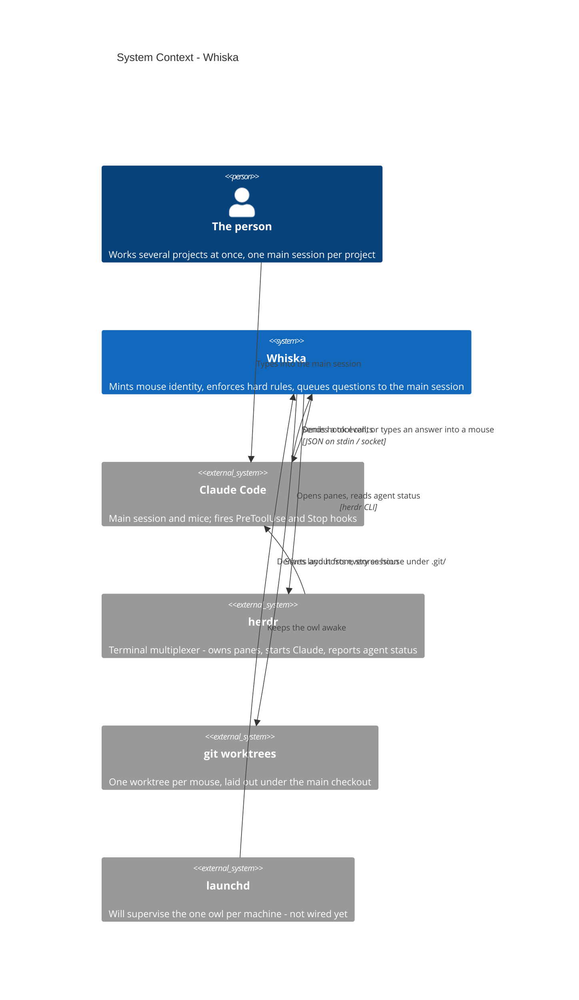

# System Context — Whiska

Level 1. Who and what Whiska sits between.

Whiska coordinates Claude Code sessions ("mice") working in isolated git worktrees. It
does not run Claude Code itself and it does not manage terminals — herdr does both
(ADR-0020). Whiska's job is identity, rules, and getting a mouse's question in front of
the person exactly once.

## The three actors worth naming

- **The person** never talks to Whiska's storage directly. They type into a main session
  and answer one question at a time.
- **herdr is unchanged by this project** (ADR-0020). A mouse is not a new runtime thing —
  it is a name for a herdr pane running Claude Code. This is also the one boundary where
  mocking is allowed in tests (ADR-0031).
- **launchd** matters because there is exactly one owl per machine, not one process per
  repo (ADR-0001). The owl exists today but runs in the foreground; the supervision is
  designed, not wired.
