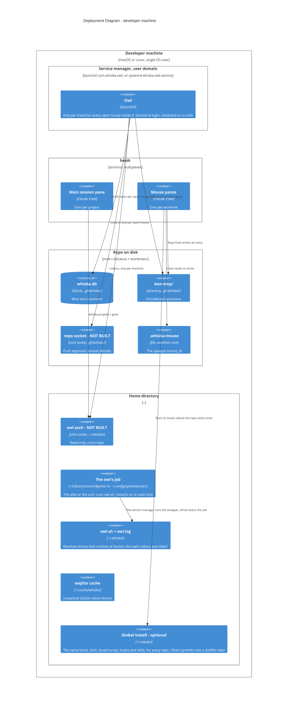

# Deployment — one machine

Everything runs on the person's own laptop as one OS user. There is no server and no
network hop; every endpoint is a Unix socket or a file.

## What the placement buys

**Sockets under the repo's own `.git/` are the security property** (ADR-0024, ADR-0001).
A rogue process cannot guess a shared port — it has to already be inside a specific repo
to find that repo's socket. That survived the move from one process per repo to one owl,
because one process can listen on many private sockets. On top of that, a request must
present the actual marker-file content (not merely claim an id), and the listening side
asks the kernel for the peer PID (`LOCAL_PEERPID`, unfakeable by the connecting process)
and walks its real parent chain to confirm it descends from the legitimate `claude`
process for that worktree.

Stated honestly: everything runs as the same OS user with no sandboxing. This stops
accidental and casual spoofing, not a determined co-resident attacker. Airtight would
need OS-level isolation, which is out of scope.

**The global socket at `~/.whiska/owl.sock` is deliberately weaker** (ADR-0025). It only
answers read-only "what is open, where", can never approve a push or act on a mouse, so
ordinary file permissions are enough. It is also why `whiska projects` and `whiska goto`
are the only commands that work from anywhere on the machine rather than inside a repo.

**`~/.cache/whiska/` exists only because an escript is a zip.** Native code cannot be
`dlopen`ed out of one, so the bundled SQLite library unpacks there on first run — 627 ms,
once. It disappears with ADR-0033's native hook client.

**`~/.claude/` is the second place the same install can live** (ADR-0056). A repo that
cannot carry a committed `.claude/` — someone else's repo, or one whose owners will not
take another tool's hooks — would otherwise spawn mice with none of the rules, because an
uncommitted file is in no worktree git creates. `whiska init --global` writes the identical
relative paths under `~` instead: the block in `~/.claude/CLAUDE.md`, the shim and the
board script in `~/.claude/hooks/`, both hooks and the statusline in
`~/.claude/settings.json`, and all nine skills in `~/.claude/skills/`. Nothing in the hooks was
ever repo-specific — which worktree they are firing in comes from where the session started
(ADR-0053), and the board file is found by walking up from the session's directory — so the
move costs nothing. What stays in the repo is the house under `.git/whiska`, which was
never committed anyway.

The boundary that moves with it is who wins. Claude Code merges the hook arrays from both
files, so in a repo that wires Whiska itself the global shim exits before resolving
anything: the repo's copy is in force and this one stands down. These paths are also
commonly symlinks into a dotfiles repo, so every write goes through the link and changes
the target in place; replacing the link would disconnect that repo silently.

**The owl's job lives in the user's own service-manager domain** (ADR-0040,
ADR-0077). On macOS it is the LaunchAgent
`com.whiska.owl` in launchd's `gui` domain, at
`~/Library/LaunchAgents/com.whiska.owl.plist`. On Linux it is the systemd user unit
`whiska-owl.service`, at `~/.config/systemd/user/whiska-owl.service`. Either starts the owl
at login and restarts it on a crash. Either runs the wrapper in `~/.whiska/` rather than
the escript, because neither manager's `PATH` can find `escript`, and the wrapper shares
the hook shim's runtime lookup. The owl it starts takes no arguments and opens what the
open-houses record lists. Under systemd, the owl stops when the person's last session ends
unless lingering is on.

**What actually exists today**: `whiska.db`, `.whiska-mouse`, `doorstep/`, the cache, the
open-houses record, the global install, the owl's job (plist or unit) with its wrapper and log, and the
owl itself with its houses and herdr subscription. Not yet: either socket, and `whiska stop` for one house. The
two sockets are drawn because their placement is the security argument above, not because
they are written.
