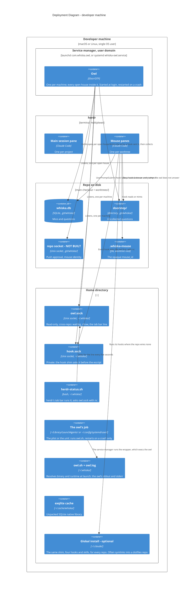

# Deployment — one machine

Everything runs on the person's own laptop as one OS user. There is no server and no
network hop; every endpoint is a Unix socket or a file.

## What the placement buys

Sockets under a repo's own `.git/` are the security property: a rogue process cannot
guess a shared port, it has to already be inside the repo (ADR-0024, ADR-0001). The two
sockets in `~/.whiska/` are deliberately weaker, one read-only and one trusting its caller
as the escript trusts stdin, and they sit in the home so no socket path passes macOS's
104-byte cap (ADR-0033). `~/.cache/whiska/` exists because an escript is a zip and native
code must be unpacked before it can be loaded. `~/.claude/` is the second place the same
install can live, for a repo that cannot carry a committed `.claude/`; its paths are often
symlinks into a dotfiles repo, so every write goes through the link (ADR-0056). The owl's
job is in the user's own service-manager domain and runs the wrapper because neither
manager's `PATH` finds `escript`; under systemd the owl stops with the person's last
session unless lingering is on (ADR-0040).

Not built: the repo socket, drawn because its placement is the security argument, and
`whiska stop` for one house.
