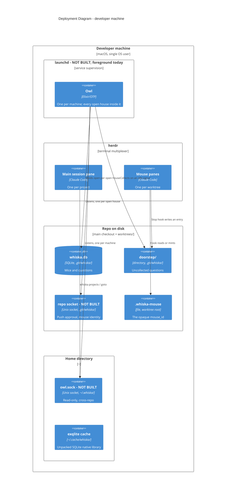

# Deployment — one machine

Everything runs on the person's own laptop as one OS user. There is no server and no
network hop; every endpoint is a Unix socket or a file.

## What the placement buys

**Sockets under the repo's own `.git/` are the security property** (ADR-0024, ADR-0001).
A rogue process cannot guess a shared port — it has to already be inside a specific repo
to find that repo's socket. That survived the move from one process per repo to one owl,
because one process can listen on many private sockets. On top of that, a request must
present the actual marker-file content (not merely claim an id), and the listening side
asks the kernel for the peer PID (`LOCAL_PEERPID`, unfakeable by the connecting process)
and walks its real parent chain to confirm it descends from the legitimate `claude`
process for that worktree.

Stated honestly: everything runs as the same OS user with no sandboxing. This stops
accidental and casual spoofing, not a determined co-resident attacker. Airtight would
need OS-level isolation, which is out of scope.

**The global socket at `~/.whiska/owl.sock` is deliberately weaker** (ADR-0025). It only
answers read-only "what is open, where", can never approve a push or act on a mouse, so
ordinary file permissions are enough. It is also why `whiska projects` and `whiska goto`
are the only commands that work from anywhere on the machine rather than inside a repo.

**`~/.cache/whiska/` exists only because an escript is a zip.** Native code cannot be
`dlopen`ed out of one, so the bundled SQLite library unpacks there on first run — 627 ms,
once. It disappears with ADR-0033's native hook client.

**What actually exists today**: `whiska.db`, `.whiska-mouse`, `doorstep/`, the cache, and
the owl itself with its houses and herdr subscription — run in the foreground as
`whiska owl <repo>…`, with the repos to open named on the command line. Not yet: either
socket, `whiska start`/`stop`, and launchd supervision. The two sockets are drawn because
their placement is the security argument below, not because they are written.
