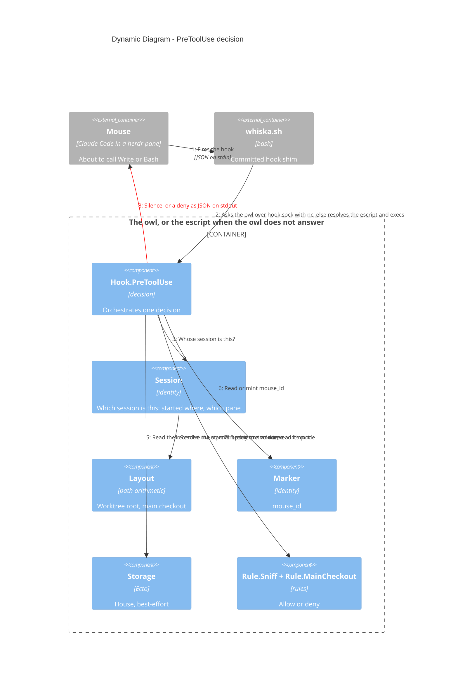

# Dynamic — one `PreToolUse` decision (built)

A mouse in a worktree tries to edit something; Whiska decides and either says nothing
(allow) or prints a deny. The owl decides it in about 16 ms when it answers its hook
socket, and the escript in about 245 ms when it does not (ADR-0033). Both run the same
modules, so the steps below are the same either way.

> Mermaid numbers a `C4Dynamic` diagram's relationships itself, in declaration
> order — so the order of the `Rel` lines below is the flow, and the step numbers
> in the prose match what renders.

## Reading the steps

**Step 2 is where the shim earns its keep.** It reads the payload and sends it to
`~/.whiska/hook.sock` with `nc -U`, with the hook's name and the few environment variables
the hooks read — `HERDR_ENV`, `HERDR_PANE_ID`, `CLAUDE_PROJECT_DIR`, `HOME`, `PWD` — and
the owl runs the steps below in its own process. Anything short of an answer within two
seconds sends the shim on to the escript with the payload it already read. Finding that
escript is the other half of its job: a hook does not inherit an interactive shell's
`PATH`, and a `mix escript.build` binary starts with `#!/usr/bin/env escript`, so with a
version manager the runtime is simply not found. The shim looks on `PATH`, asks `asdf`,
then reads the install directory directly. `WHISKA_BIN`, `WHISKA_ESCRIPT` and
`WHISKA_HOOK_SOCKET` override each.

**Steps 3 and 4 read an identity, not a position.** The directory Claude Code passes the
hook follows every `cd` the session runs, so the worktree comes from the directory the
session *started* in, read from the first entry of its own transcript (ADR-0053). Step 4
can fail, and that is usually an allow: a start directory outside `worktrees/<branch>/` —
the main checkout itself included — returns `{:error, :not_a_mouse}` and the call goes
through.

**One failure is not an allow.** A start directory *under* the `worktrees/` container
that is no checkout of its own — the ordinary folder a slashed branch nests under — is
nobody: no mouse, no mode, no marker minted (ADR-0030). Containment does not go
with identity. `Layout.unplaced/1` reads the same folder for the main-checkout rule
alone, and a write into the main checkout from there is denied like any other
(ADR-0013). A folder Whiska cannot identify is where it can vouch for least, so it fails
closed on the one path that bypasses every other guard.

**Step 5 settles whose pane this is, then reads the mode.** A tool call firing in the pane
`whiska start` recorded is the person's own session: no mouse, no rules, nothing recorded,
and the call is allowed. The pane is the hook's own `HERDR_PANE_ID`, the one the shim
sent, never the owl's: an owl started by hand in the main session's pane would otherwise
take every mouse for the main session. Inside the owl the house is opened on a
connection of the hook's own, so hooks for two repos at once never collide. Both answers come out of the one house opening, so nothing opens
twice. The mode half is best-effort and step 7 does not depend on it — if it cannot be
read, Whiska assumes `build` and says so on stderr, and worktree containment is pure path
arithmetic that keeps working regardless.

**Step 8 always exits 0.** The decision travels in the JSON body. A non-zero exit would
read to Claude Code as the hook itself having failed, which is a different and worse
signal than "denied".

## Where the time goes

| What runs | Per invocation |
|---|---|
| The shim, the owl answering (ADR-0033) | ~16 ms |
| The shim, no owl: the escript | ~245 ms |
| `whiska --version` — escript boot floor | 126 ms |
| First run ever, which also unpacks the bundled SQLite library | 627 ms, once |

Of the 16 ms, bash starting is about 2, `nc` itself about 7, and the owl's own work about
3 — most of that opening the house's database for the request. Nothing inside the escript
can remove its first 126 ms, which is why the owl answers when it can. That is why the installed matcher is
`Write|Edit|MultiEdit|NotebookEdit|Bash` and not `*`: `Read`, `Grep` and `Glob` are a
large share of all tool calls, can never be denied, and never pay the cost.
