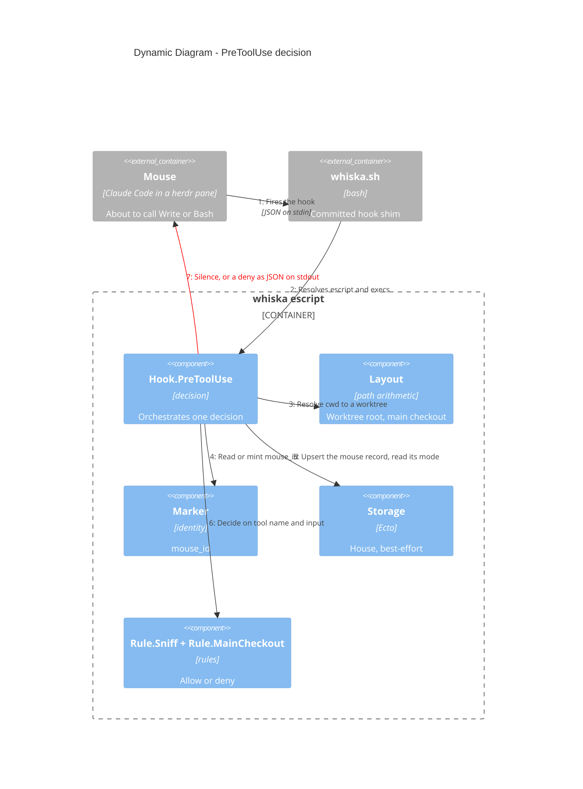

# Dynamic — one `PreToolUse` decision (built)

The only flow that runs end to end today. A mouse in a worktree tries to edit something;
Whiska decides in ~220 ms and either says nothing (allow) or prints a deny.

> Mermaid numbers a `C4Dynamic` diagram's relationships itself, in declaration
> order — so the order of the `Rel` lines below is the flow, and the step numbers
> in the prose match what renders.

## Reading the steps

**Step 2 is where the shim earns its keep.** A hook does not inherit an interactive
shell's `PATH`, and a `mix escript.build` binary starts with `#!/usr/bin/env escript`, so
with a version manager the runtime is simply not found. The shim looks on `PATH`, asks
`asdf`, then reads the install directory directly. `WHISKA_BIN` and `WHISKA_ESCRIPT`
override both.

**Step 3 can fail, and that is an allow.** Not being inside `worktrees/<branch>/` — which
includes the main checkout itself — returns `{:error, :not_in_worktree}` and the call
goes through. v0.0.1 polices mice, not the main session.

**Step 5 is best-effort and step 6 does not depend on it.** If the mode cannot be read,
Whiska assumes `build` and says so on stderr; worktree containment is pure path
arithmetic and keeps working regardless.

**Step 7 always exits 0.** The decision travels in the JSON body. A non-zero exit would
read to Claude Code as the hook itself having failed, which is a different and worse
signal than "denied".

## Where the time goes

| What runs | Per invocation |
|---|---|
| `whiska --version` — escript boot floor | 126 ms |
| `whiska hook pre-tool-use` — the real job, SQLite included | ~220 ms |
| First run ever, which also unpacks the bundled SQLite library | 627 ms, once |

The SQLite work itself — open, migrate, upsert — is under 2 ms. Nothing inside the
program can remove the first 126 ms. That is why the installed matcher is
`Write|Edit|MultiEdit|NotebookEdit|Bash` and not `*`: `Read`, `Grep` and `Glob` are a
large share of all tool calls, can never be denied, and never pay the cost.
