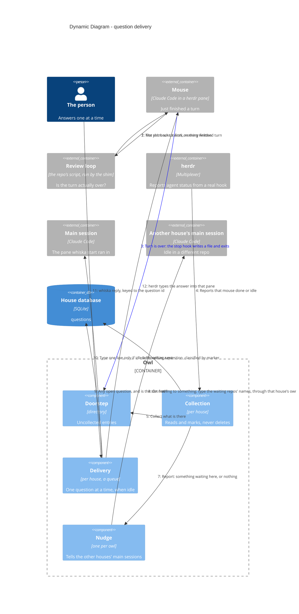

# Dynamic — a question from doorstep to answer

**All of this is built and tested**: the review loop in front of the doorstep (ADR-0042),
the doorstep and collection (ADR-0036), classification (ADR-0009), the idle-gated delivery
queue (ADR-0008), the reply keyed to a question id (ADR-0005), and the nudge to the other
open houses (ADR-0041). Shown as a dynamic diagram because the ordering is the design.

> Mermaid numbers a `C4Dynamic` diagram's relationships itself, in declaration
> order — so the order of the `Rel` lines below is the flow, and the step numbers
> in the prose match what renders.

## Steps 1–2 — the review loop decides whether the turn is over (ADR-0042)

A mouse ending a turn on `done` is its own opinion. The repo's own script —
`.claude/hooks/review-loop.sh`, which Whiska writes once and never reads — runs the repo's
check command and asks for one diff review against `specs/` and `docs/adr/`. Until it is
satisfied it blocks the stop, and the mouse goes back to work.

It is chained by the shim rather than registered as a second `Stop` entry, because Claude
Code runs `Stop` hooks in parallel: side by side, step 3 below happened anyway, and the
person was told the mouse had finished while it was still looping. A turn ending on
`needs-decision`, or on no marker at all, skips the loop entirely and goes straight on.

## Step 3 — the hook never opens a socket (ADR-0036)

The obvious design connects to the house's socket, and then has to answer what happens
when nothing is listening. The spec required that case to "fail loudly", but loudly has
no target: the hook is a short-lived process whose stderr lands in the mouse's own
transcript, seen by the mouse and nobody else. So the hook writes to the doorstep and
exits, every time. No connect timeout, no retry, no error handling, and no second code
path that differs between a healthy machine and a broken one.

## Steps 4–5 — collection is event-driven, not a sweep

herdr reporting a mouse `done` or `idle` is what triggers collection of that house;
opening the house collects too, and a slow timer is only a backstop. An idle collection
that finds the doorstep empty — the mouse's `Stop` hook may still be writing — looks again
after 2 s and 5 s, and stops as soon as anything is found. Because
`pane.agent_status_changed` can only be subscribed per pane id, the house first matches
each pane's `cwd` to a mouse's worktree to learn which panes are its own. Collection reads
and marks — it never deletes and never touches the worktree (ADR-0007).

## Step 6 — classification is the mouse's marker, nothing more (ADR-0009)

No heuristics, no model reading the text. **A marker is required to be quiet, not to be
heard:**

- no marker at all → **deliver**. The mouse stopped and did not say why.
- `done` → delivered as "finished", no reply offered, closed the moment it is sent.
- `needs-decision` → delivered. Still valid, now redundant.

Forgetting is the safe direction: a mouse that forgets its marker makes noise instead of
vanishing.

An entry whose worktree is no longer on disk is **recorded but never delivered** — there
is nowhere to reply and nothing left to change. One whose worktree still exists *is*
delivered even if its mouse is dead, because `whiska reopen <branch>` can start a fresh
pane on it.

## Steps 7–8 — the nudge to every other open house (ADR-0041)

After each collection the house tells the owl's one Nudge process whether it has an open
or sent question other than a `done` report. On the change from nothing to something,
Nudge asks every other house in the open-houses record to type `⚡ <folders> waiting`
into its main session — through that house's own idle-and-slot gate, so a busy pane or a
house with its own question out gets nothing, and nothing is retried. The line is a
notice: never recorded, never answered, never holding a slot. It exists because Claude
Code redraws a statusline only when that session's own conversation changes; without it
the elsewhere segment (ADR-0027) is invisible exactly where it matters.

## Steps 9–10 — a queue, not a batch (ADR-0008)

Deliver only when the main session is idle *and* has no other question sent and waiting
for its answer. Anything else joins the pile silently. That single rule, not a timer, is
what stops a double ping. The one exception that earns a timer: the first question of a
fresh round waits up to 8 s, so the first thing you see is "3 open" rather than "1 open"
with more trickling in. A newer question from the same mouse supersedes its earlier ones,
so a mouse that moves on cannot wedge the queue (ADR-0037).

When herdr reports `claude` + `unknown` — the integration is broken — **deliver anyway
and say so**. Holding there is not caution, it is choosing silence, and the person would
never learn why the mice went quiet.

## Steps 11–12 — answers are keyed to a question id (ADR-0005)

Not to a branch. That is what stops an answer landing on whichever question Whiska
happened to guess. `whiska reply <id>` writes the answer to the house; the owl looks up
the question's mouse pane and asks herdr to type there (ADR-0020) — it never owns a
Claude Code process itself.
