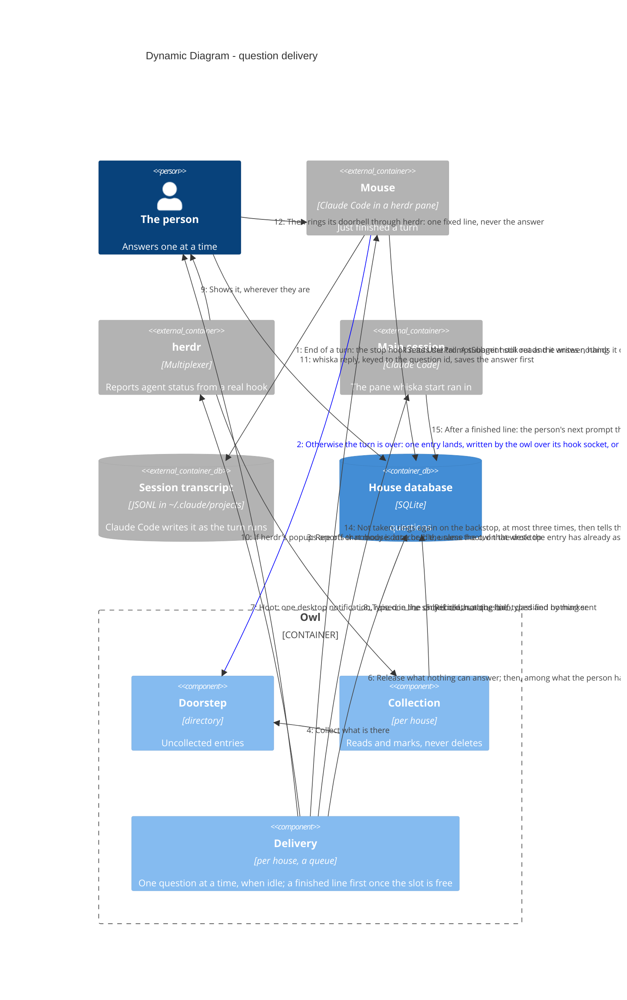

# Dynamic — a question from doorstep to answer

**All of this is built and tested**: the doorstep and collection (ADR-0036),
classification (ADR-0009), the hook's reading of the transcript before it writes anything
(ADR-0052), the idle-gated delivery queue (ADR-0008) with its hold while
the person is typing (ADR-0047) — said on the main checkout's sidebar line once it has lasted (ADR-0058) — the
release of anything nothing can answer (ADR-0057), the hoot that goes out with the line
(ADR-0062), the reply keyed to a question id (ADR-0005), and the answer taken by the mouse's own hook rather than typed (ADR-0080). Shown as a dynamic diagram because the ordering is the
design. Nothing here crosses into another repo: the nudge that once did was deleted by
ADR-0044.

> Mermaid numbers a `C4Dynamic` diagram's relationships itself, in declaration
> order — so the order of the `Rel` lines below is the flow, and the step numbers
> in the prose match what renders.

Finishing happens before any of this, inside the turn: the mouse runs its own pipeline —
brief, checks, reviewers, one more round, a commit on its branch — and only then writes the
marker (ADR-0049).
Nothing sits in front of the stop hook, and nothing in Whiska knows whether that pipeline
ran.

## Steps 1–2 — the hook reads the turn, then the entry lands on the doorstep

A background subagent ends the mouse's turn every time the mouse waits on one, and the
finish pipeline sends three (ADR-0049). So the hook's first act is to read the tail of
the transcript Claude Code hands it: an agent launched with no hand-back against it means
the turn is not over, and the hook exits quietly with nothing written (ADR-0052). Anything
it cannot read counts as over, so the direction it fails in is noise rather than silence.

Then the entry is written, and where it goes does not depend on whether the owl is up
(ADR-0036, amended 2026-10-07). The shim asks the owl first, over `~/.whiska/hook.sock`
(ADR-0033): the owl runs the same `Whiska.Hook.Stop`, with the hook's own environment,
and leaves the entry on the doorstep itself. When the owl does not answer within two
seconds — no socket, a socket file a crashed owl left, an owl that is hung — the shim runs
the escript, which writes the very same entry.

What the original design defended still holds. A hook cannot "fail loudly" to anyone:
its stderr lands in the mouse's own transcript, seen by the mouse and nobody else. So a
dead owl is not an error the hook reports; it is simply the slower path, and the
question still reaches the doorstep. There are two transports now, and one piece of logic
behind both. The doorstep is still the only way a question gets into a house.

## Steps 3–4 — collection is event-driven, not a sweep

When the owl wrote the entry itself, it asks the house to collect at once, after the
shim has its answer, and herdr's event that follows usually finds nothing left. Otherwise
herdr reporting a mouse `done` or `idle` is what triggers collection of that house;
opening the house collects too, and a slow timer is only a backstop. An idle collection
that finds the doorstep empty — the mouse's `Stop` hook may still be writing — looks again
after 2 s and 5 s, and stops as soon as anything is found. Because
`pane.agent_status_changed` can only be subscribed per pane id, the house first matches
each pane's `cwd` to a mouse's worktree to learn which panes are its own. Collection reads
and marks — it never deletes and never touches the worktree (ADR-0007).

## Step 5 — classification is the mouse's marker, nothing more (ADR-0009)

No heuristics, no model reading the text. **A marker is required to be quiet, not to be
heard:**

- no marker at all → **deliver**. The mouse stopped and did not say why.
- `done` → delivered as "finished", no reply offered, behind whatever is sent but ahead of
  the queue, and holding the slot once sent until the person writes something in the main
  session.
- `needs-decision` → delivered. Still valid, now redundant.

Forgetting is the safe direction: a mouse that forgets its marker makes noise instead of
vanishing.

An entry whose worktree is no longer on disk is **recorded but never delivered** — there
is nowhere to reply and nothing left to change. One whose worktree still exists *is*
delivered even if its mouse is dead, because `whiska reopen <branch>` can start a fresh
pane on it.

## Nothing goes to another repo (ADR-0044, ADR-0048)

Two steps between collection and delivery used to be the nudge: the house reported to
the owl's one Nudge process, which typed `⚡ <folders> waiting` into every other open
house's main session. Its
purpose was real — Claude Code redraws a statusline only when that session's own
conversation changes, so the elsewhere segment (ADR-0027) was invisible exactly where it
mattered — but its means were not: the line arrived as a user turn the other session's
Claude could not tell from a prompt, and cost that session a turn each time.

The machine-wide view has since left Claude Code: herdr's tab bar draws one line for the
whole session and runs it on its own timer, reading every recorded house off disk
(ADR-0048). Each repo's own mice are lines its house reports under their workspaces in
herdr's sidebar, which needs nothing from any other house. Nothing in this flow reaches out of the repo it
started in.

## Steps 6–8 — a queue, not a batch (ADR-0008)

Deliver only when the main session is idle *and* has no other question sent and waiting
for its answer. Anything else joins the pile silently. That single rule, not a timer, is
what stops a double ping. The one exception that earns a timer: the first question of a
fresh round waits up to 8 s, so the first thing you see is "3 open" rather than "1 open"
with more trickling in. A newer question from the same mouse supersedes its earlier ones,
so a mouse that moves on cannot wedge the queue (ADR-0037).

A finished line waits for the slot like any question, so it never lands over a decision
the person is still reading: once the slot is free it goes ahead of whatever is queued
(ADR-0008, note of 2026-10-06). Once typed it holds the slot itself, until the person's
next prompt in the main session — whatever it says, short of the owl's own 🐱 line. The
owl raises a flag in the main checkout's `.git` as it types the line, so the shim lets that
prompt through to the `UserPromptSubmit` hook, which closes the report and lowers the flag
(note of 2026-10-08). `dismiss`, a hold on the branch, or the branch's next message free it
too. Several go one per prompt of the person's, each line counting `n more finished` apart
from `n more open`. The idle
gate and the draft gate still apply to it — it lands in the same prompt box. Freeing the
slot starts no round: the first-of-round wait opens only on a collection that finds the
house quiet.

A mouse that *dies* cannot wedge it either: marking it dead takes everything it left
waiting out of the queue, sent as well as open (ADR-0007), because no answer can reach a dead mouse and a
question nobody can answer would otherwise hold the one slot forever. The owl frees it by
itself — at house open, where reconciling against `pane.list` catches whatever died while
the owl was down, and on the backstop.

Nor can anything else that cannot be answered (ADR-0057). The release runs **before every
delivery attempt**, so the order of a death and a collection stops mattering: a question
left on the doorstep by a mouse that was marked dead in the meantime is released rather
than delivered, and so is one belonging to a record that no longer stands for a worktree
of this house (ADR-0051). Released means `settled` where the mouse's branch landed — the
merge was the answer, and it is counted on no line at all — and `orphaned` where it did
not, which is kept, counted on the main checkout's sidebar line, and read with
`whiska questions`, which says there is nowhere to reply (ADR-0064).
`whiska doctor` still names a dead mouse holding the slot, now as a thing that should not
be there rather than a state to wait out.

Before any of that, the queue is judged against what the person set aside
(ADR-0079). Nothing goes while they are **away**,
which is one file under the whiska home read by every house; under a **focus** only the
focused mouse's questions go, and another mouse's `sent` question no longer holds the
slot against it; a **held** mouse's questions never go, and its `sent` one frees the slot
too. A `sent` question set aside this way stays `sent` — nothing is delivered twice — and
once the mode is lifted the queue waits behind the oldest `sent` one again, oldest first.
The person sets all three from a CLI process the owl cannot hear, so the house compares
the mode on the tick that already rebuilds the sidebar's board and attempts a delivery when it
moved: a `resume` is followed by the first waiting question within about two seconds.

When herdr reports `claude` + `unknown` — the integration is broken — **deliver anyway
and say so**. Holding there is not caution, it is choosing silence, and the person would
never learn why the mice went quiet.

Step 6 is the second half of the same gate (ADR-0047). Idle is the model's word: the
person can have a half-typed prompt sitting in the box while the pane is every bit as
idle, and the line would land inside it or submit it. herdr has no input signal, so
delivery reads the pane's visible screen and looks for Claude Code's prompt box, which is
the lowest frame of horizontal rules at column 0 that holds a prompt line (ADR-0068 — the
marker `❯` is also how Claude Code redraws past messages, and a stray rule under the box
would frame the status lines). A draft in it holds the question — open,
first in the queue, gone on the next trigger once the box clears — and `whiska doctor`
says `gated: person is typing` meanwhile. A hold that lasts more than ten seconds also
says so on the main checkout's sidebar line: `⏳ gated: you're typing`
(ADR-0058; the word was "held" until a mouse on hold took it). Nothing is ever
typed into a box the person is mid-sentence in.

A screen with **no box at all** holds too, and says `gated: your prompt box isn't on
screen`: a permission prompt or a picker is waiting on the person, or the pane is
scrolled away, and in the first case the line's own return key would answer the dialog. A
frame whose contents Whiska cannot read is the unavailable signal, and delivers for the
reason above.

## Steps 9–11 — the hoot goes out with the line (ADR-0062)

The line only reaches somebody already looking at the main session, and the reason a mouse
leaves a question on the doorstep is that they are not. So delivery raises a desktop
notification as it types — one per delivered question, from the same branch of the same
function, so there is no state in which the line exists and the hoot does not. It carries
the house, the branch, the verb and the id, in the line's own words: `🐱 whiska · feat-a
needs a decision` over `#12 · "pick one" · 2 more open`. A decision takes herdr's
`request` sound, a finished branch its `done` one; both arrive, and the one that must not
be missed is told from the other without looking.

A question that is only collected, or held by any part of the gate above, does not hoot —
it is not on the person's screen yet, and a hoot would announce something they could not
go and read.

herdr is asked to show it, from the person's own `[ui.toast]` and `[ui.sound]` settings, and
its reply says whether it drew anything and why not. When the reason is `disabled` or
`no_foreground_client`, step 11 raises the same hoot on the desktop with `terminal-notifier`
or `osascript` on macOS, or `notify-send` on Linux (ADR-0071): herdr's one popup switch also silences
its toast for every mouse, and turning that off is not asking for Whiska to go quiet.
`rate_limited` and `busy` are herdr pacing itself, and do not fall back. `whiska doctor`
sends a hoot of its own down the same path and reports what showed it, which is the
answer and the demonstration in one. Everything the hoot can do wrong is swallowed, because
the question is already recorded sent by then and delivery is the job.

## Steps 12–15 — answers are keyed to a question id, and taken, not typed

Keyed to an id, not to a branch (ADR-0005). That is what stops an answer landing on
whichever question Whiska happened to guess.

Taken, not typed (ADR-0080). `whiska reply <id>` saves the
answer to the house first — the question is `answered` and the slot free from that moment
— then asks herdr to type one fixed line into the mouse's pane, the doorbell (ADR-0020:
Whiska never owns a Claude Code process). The answer itself never goes through the
terminal: the mouse's own `UserPromptSubmit` hook, running in that session, reads it from
the house and hands it to the model as context, multi-line and whole, and stamps it taken.
That stamp is the proof it arrived. A doorbell that rang but was swallowed leaves no
stamp, so the owl rings again on its backstop — at least 90 s apart, at most three times,
only into an idle pane with an empty box — and after that marks the answer not taken and
raises one hoot. Any prompt in that pane hands it over, so typing anything there is the
fix.

## Step 16 — the person's next prompt frees a finished line's slot

A finished line holds the slot once typed (ADR-0008, note of 2026-10-08), so the next line
cannot land over the report the person is reading. Their next prompt in the main session,
whatever it says, runs the same `UserPromptSubmit` hook there: the owl raised a flag in the
main checkout's `.git` as it typed the line, so the shim lets the prompt through, and the
hook closes the report and lowers the flag. The owl's own 🐱 line does not count. When that
prompt's turn ends the pane goes idle, and the next line goes.
