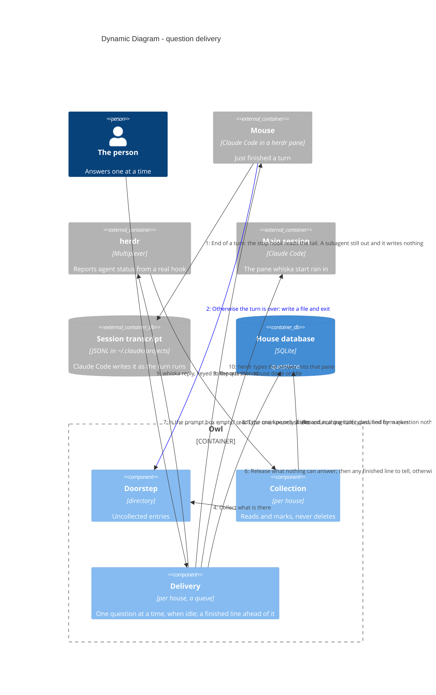

# Dynamic — a question from doorstep to answer

**All of this is built and tested**: the doorstep and collection (ADR-0036),
classification (ADR-0009), the hook's reading of the transcript before it writes anything
(ADR-0052), the idle-gated delivery queue (ADR-0008) with its hold while
the person is typing (ADR-0047) — said on the board once it has lasted (ADR-0058) — the
release of anything nothing can answer (ADR-0057), and the reply keyed to a question id
(ADR-0005). Shown as a dynamic diagram because the ordering is the
design. Nothing here crosses into another repo: the nudge that once did was deleted by
ADR-0044.

> Mermaid numbers a `C4Dynamic` diagram's relationships itself, in declaration
> order — so the order of the `Rel` lines below is the flow, and the step numbers
> in the prose match what renders.

Finishing happens before any of this, inside the turn: the mouse runs its own pipeline —
brief, checks, reviewers, one more round — and only then writes the marker (ADR-0048).
Nothing sits in front of the stop hook, and nothing in Whiska knows whether that pipeline
ran.

## Steps 1–2 — the hook reads the turn, then writes, and never opens a socket

A background subagent ends the mouse's turn every time the mouse waits on one, and the
finish pipeline sends three (ADR-0049). So the hook's first act is to read the tail of
the transcript Claude Code hands it: an agent launched with no hand-back against it means
the turn is not over, and the hook exits quietly with nothing written (ADR-0052). Anything
it cannot read counts as over, so the direction it fails in is noise rather than silence.

Then it writes, and that write never opens a socket (ADR-0036).

The obvious design connects to the house's socket, and then has to answer what happens
when nothing is listening. The spec required that case to "fail loudly", but loudly has
no target: the hook is a short-lived process whose stderr lands in the mouse's own
transcript, seen by the mouse and nobody else. So the hook writes to the doorstep and
exits, every time. No connect timeout, no retry, no error handling, and no second code
path that differs between a healthy machine and a broken one.

## Steps 3–4 — collection is event-driven, not a sweep

herdr reporting a mouse `done` or `idle` is what triggers collection of that house;
opening the house collects too, and a slow timer is only a backstop. An idle collection
that finds the doorstep empty — the mouse's `Stop` hook may still be writing — looks again
after 2 s and 5 s, and stops as soon as anything is found. Because
`pane.agent_status_changed` can only be subscribed per pane id, the house first matches
each pane's `cwd` to a mouse's worktree to learn which panes are its own. Collection reads
and marks — it never deletes and never touches the worktree (ADR-0007).

## Step 5 — classification is the mouse's marker, nothing more (ADR-0009)

No heuristics, no model reading the text. **A marker is required to be quiet, not to be
heard:**

- no marker at all → **deliver**. The mouse stopped and did not say why.
- `done` → delivered as "finished", no reply offered, ahead of the queue and closed the
  moment it is sent.
- `needs-decision` → delivered. Still valid, now redundant.

Forgetting is the safe direction: a mouse that forgets its marker makes noise instead of
vanishing.

An entry whose worktree is no longer on disk is **recorded but never delivered** — there
is nowhere to reply and nothing left to change. One whose worktree still exists *is*
delivered even if its mouse is dead, because `whiska reopen <branch>` can start a fresh
pane on it.

## Nothing goes to another repo (ADR-0044, ADR-0048)

Two steps between collection and delivery used to be the nudge: the house reported to
the owl's one Nudge process, which typed `⚡ <folders> waiting` into every other open
house's main session. Its
purpose was real — Claude Code redraws a statusline only when that session's own
conversation changes, so the elsewhere segment (ADR-0027) was invisible exactly where it
mattered — but its means were not: the line arrived as a user turn the other session's
Claude could not tell from a prompt, and cost that session a turn each time.

The machine-wide view has since left Claude Code: herdr's tab bar draws one line for the
whole session and runs it on its own timer, reading every recorded house off disk
(ADR-0048). What Claude Code's statusline still draws is that repo's own line, which
needs nothing from any other house. Nothing in this flow reaches out of the repo it
started in.

## Steps 6–8 — a queue, not a batch (ADR-0008)

Deliver only when the main session is idle *and* has no other question sent and waiting
for its answer. Anything else joins the pile silently. That single rule, not a timer, is
what stops a double ping. The one exception that earns a timer: the first question of a
fresh round waits up to 8 s, so the first thing you see is "3 open" rather than "1 open"
with more trickling in. A newer question from the same mouse supersedes its earlier ones,
so a mouse that moves on cannot wedge the queue (ADR-0037).

The slot counts questions, and a finished line is not one: nothing is waiting on the
person in it. It goes ahead of whatever is queued, takes no slot and is closed as it is
typed, so a branch that is done is heard about while a decision elsewhere is still out
(ADR-0008, note of 2026-10-01). The idle gate, the draft gate and the first-of-round wait
all still apply to it — it lands in the same prompt box and carries the same count.

A mouse that *dies* cannot wedge it either: marking it dead orphans everything it left
waiting, sent as well as open (ADR-0007), because no answer can reach a dead mouse and a
question nobody can answer would otherwise hold the one slot forever. The owl frees it by
itself — at house open, where reconciling against `pane.list` catches whatever died while
the owl was down, and on the backstop.

Nor can anything else that cannot be answered (ADR-0057). The release runs **before every
delivery attempt**, so the order of a death and a collection stops mattering: a question
left on the doorstep by a mouse that was marked dead in the meantime is released rather
than delivered, and so is one belonging to a record that no longer stands for a worktree
of this house (ADR-0051). Released means orphaned — kept, counted on the board's own
`orphaned` line, and read with `whiska questions`, which says there is nowhere to reply.
`whiska doctor` still names a dead mouse holding the slot, now as a thing that should not
be there rather than a state to wait out.

When herdr reports `claude` + `unknown` — the integration is broken — **deliver anyway
and say so**. Holding there is not caution, it is choosing silence, and the person would
never learn why the mice went quiet.

Step 6 is the second half of the same gate (ADR-0047). Idle is the model's word: the
person can have a half-typed prompt sitting in the box while the pane is every bit as
idle, and the line would land inside it or submit it. herdr has no input signal, so
delivery reads the pane's visible screen and looks for Claude Code's prompt box. A draft
in it holds the question — open, first in the queue, gone on the next trigger once the
box clears — and `whiska doctor` says `held: person is typing` meanwhile. A hold that
lasts more than ten seconds also says so on the board, on its waiting line:
`🐱 3 waiting · held: your prompt box isn't empty` (ADR-0058). The gate itself is
unchanged — nothing is ever typed into a box the person is mid-sentence in. A screen with
no box on it is an unavailable signal, and delivers for the reason above.

## Steps 9–10 — answers are keyed to a question id (ADR-0005)

Not to a branch. That is what stops an answer landing on whichever question Whiska
happened to guess. `whiska reply <id>` writes the answer to the house; the owl looks up
the question's mouse pane and asks herdr to type there (ADR-0020) — it never owns a
Claude Code process itself.
