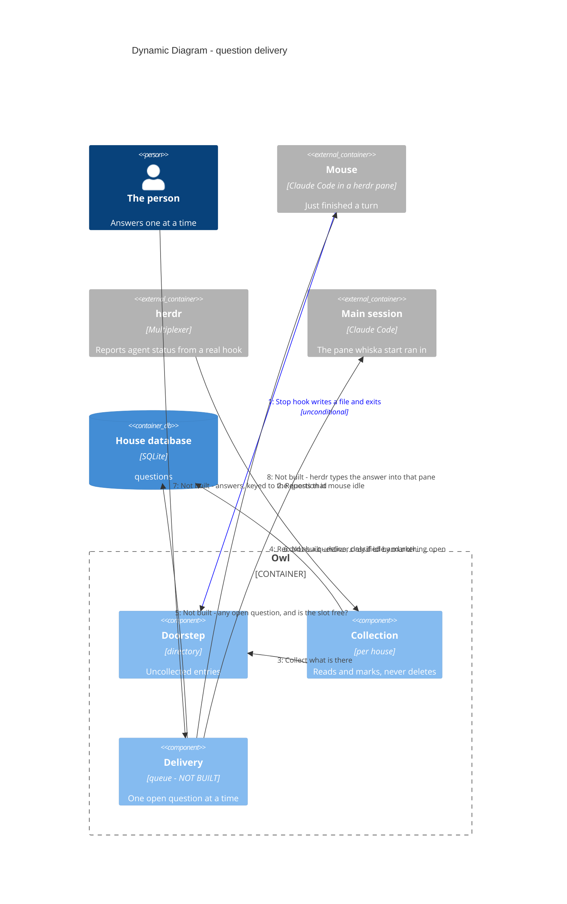

# Dynamic — a question from doorstep to answer

**Steps 1–4 are built and tested. Steps 5–8 are designed only** — the delivery slice has
not been written. Shown as a dynamic diagram because the ordering is the design.

> Mermaid numbers a `C4Dynamic` diagram's relationships itself, in declaration
> order — so the order of the `Rel` lines below is the flow, and the step numbers
> in the prose match what renders.

## Step 1 — the hook never opens a socket (ADR-0036)

The obvious design connects to the house's socket, and then has to answer what happens
when nothing is listening. The spec required that case to "fail loudly", but loudly has
no target: the hook is a short-lived process whose stderr lands in the mouse's own
transcript, seen by the mouse and nobody else. So the hook writes to the doorstep and
exits, every time. No connect timeout, no retry, no error handling, and no second code
path that differs between a healthy machine and a broken one.

## Step 2 — collection is event-driven, not a sweep

herdr reporting a mouse idle is what triggers collection of that house; opening the house
collects too, and a slow timer is only a backstop. Because
`pane.agent_status_changed` can only be subscribed per pane id, the house first matches
each pane's `cwd` to a mouse's worktree to learn which panes are its own. Collection reads and marks — it never deletes and never touches the
worktree (ADR-0007).

## Step 4 — classification is the mouse's marker, nothing more (ADR-0009)

No heuristics, no model reading the text. **A marker is required to be quiet, not to be
heard:**

- no marker at all → **deliver**. The mouse stopped and did not say why.
- `done` → recorded, never delivered. The explicit opt-out.
- `needs-decision` → delivered. Still valid, now redundant.

Forgetting is the safe direction: a mouse that forgets its marker makes noise instead of
vanishing.

An entry whose worktree is no longer on disk is **recorded but never delivered** — there
is nowhere to reply and nothing left to change. One whose worktree still exists *is*
delivered even if its mouse is dead, because `whiska reopen <branch>` can start a fresh
pane on it.

## Steps 5–6 — a queue, not a batch (ADR-0008). Not built yet.

Deliver only when the main session is idle *and* has no other open, unanswered question
sitting there. Anything else joins the pile silently. That single rule, not a timer, is
what stops a double ping. The one exception that earns a timer: the first question of a
fresh round waits up to 8 s, so the first thing you see is "3 open" rather than "1 open"
with more trickling in.

When herdr reports `claude` + `unknown` — the integration is broken — **deliver anyway
and say so**. Holding there is not caution, it is choosing silence, and the person would
never learn why the mice went quiet.

## Steps 7–8 — answers are keyed to a question id (ADR-0005). Not built yet.

Not to a branch. That is what stops an answer landing on whichever question Whiska
happened to guess. Whiska looks up the question's pane and asks herdr to type there
(ADR-0020) — it never owns a Claude Code process itself.

## What the delivery slice still has to settle

Three things, none of them recorded anywhere yet: how a house learns which pane is its
**main session** (`whiska start` is the designed answer — it records the pane it is run
from); the idle gate and the 8-second first-of-round wait, including the `claude` +
`unknown` case; and what a delivered question looks like and how a reply gets back, which
is what first needs the per-repo socket.
