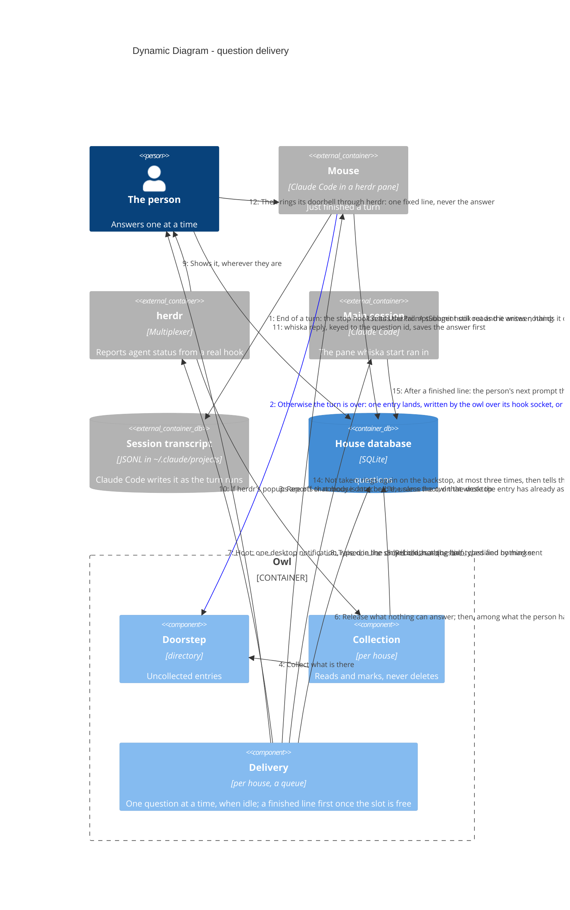

# Dynamic — a question from doorstep to answer

All of this is built. The doorstep and collection are ADR-0036, classification ADR-0009,
the hook's reading of the transcript before it writes ADR-0052, the queue and its hold
while the person is typing ADR-0008 and ADR-0047, the hoot ADR-0062, the reply keyed to a
question id ADR-0005, and the answer taken by the mouse's own hook ADR-0080. Shown as a
dynamic diagram because the ordering is the design. Nothing here crosses into another
repo (ADR-0044).

> Mermaid numbers a `C4Dynamic` diagram's relationships itself, in declaration
> order — so the order of the `Rel` lines below is the flow.

Finishing happens before any of this, inside the turn: the mouse runs its own pipeline,
brief, checks, reviewers, one more round, a commit on its branch, and only then writes the
marker (ADR-0049). Nothing sits in front of the stop hook, and nothing in Whiska knows
whether that pipeline ran.
